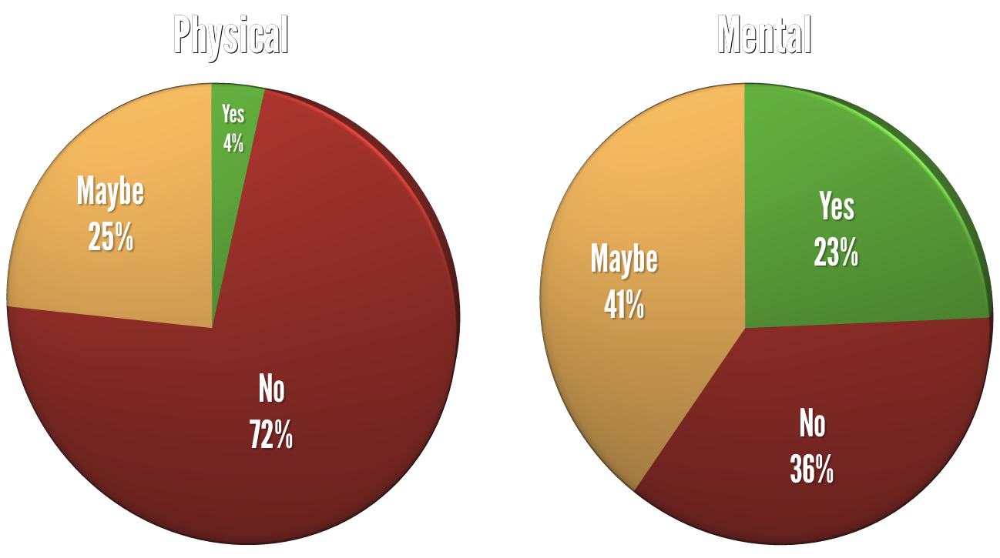
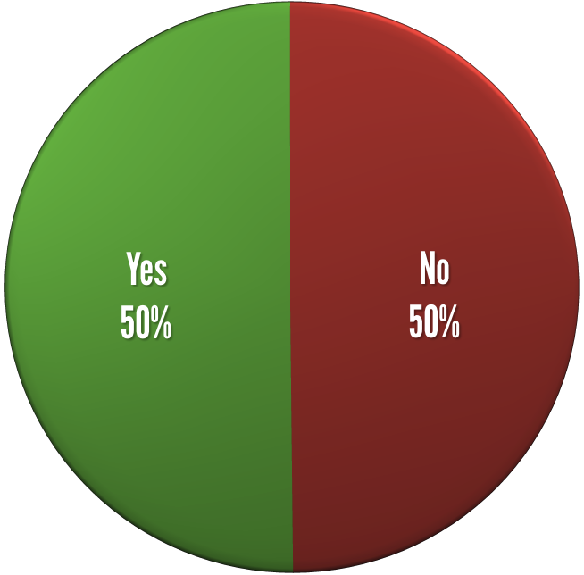

# ERASING THE STIGMA
## YOU'RE NOT ALONE

J.D. Flynn, Drupal Technical Architect at Blast Radius

@JDDoesDev • D.O: Dorficus • Slack: Dorf

Twin Cities Drupal Camp • #tcdrupal • #osmi

<!--s-->

# ABOUT ME

Note:
- Name
- Drupal/PHP Developer for 4 years
- Building sites since 90s

<!--s-->

# ABOUT THIS SESSION

- Open up the conversation about mental illness
<!-- .element: class="fragment" data-fragment-index="1" -->

- Share some resources
<!-- .element: class="fragment" data-fragment-index="2" -->

- Try out public speaking
<!-- .element: class="fragment" data-fragment-index="3" -->

Note:  This should be focused on why you're doing this talk, not why you're talking about it

<!--s-->

# QUESTION TIME
(The fun part)

Note:  This is where you ask about
- developers, PMs, HR
- diabetes, HTN, flu, etc

<!--s-->

## WHY TALK ABOUT THIS?

Paramedic for 10 years, EMT before that
<!-- .element: class="fragment" data-fragment-index="1" -->

Seen firsthand what depression can do
<!-- .element: class="fragment" data-fragment-index="2" -->

Note:  Consider anecdotes from the ambulance, but nothing too drastic or depressing.  

<!--s-->

## WHY TALK ABOUT THIS? (cont.)

Burden of mental disorders IS the largest of all disorder categories in North America - WHO 2008
<!-- .element: class="fragment"  -->

**IT NEEDS TO BE TALKED ABOUT**
<!-- .element: class="fragment important"  -->

Note:  Mention Ed/Funkatron and OSMI, source for stat is WHO 2008

<!--s-->

## WHY SHOULD THIS BE IMPORTANT TO YOU?

“In all regions, neuropsychiatric conditions are the most important causes of disability, accounting for around one third of Years Lost to Disability among adults aged 15 years and over”
(W.H.O. 2008)

<!--s-->

## WHY IS THIS IMPORTANT TO ME?

I have mental illness
<!-- .element: class="fragment" -->

People feel like they're walking on eggshells around me
<!-- .element: class="fragment" -->

*I'm not defective; I have a disease*
<!-- .element: class="fragment" -->

Note: This may be a time to mention difficulties at past job
@TODO look into a better time

<!--s-->

### TIME TO GET UNCOMFORTABLY PERSONAL

- Major Depression
<!-- .element: class="fragment" -->

- Anxiety
<!-- .element: class="fragment" -->

- PTSD
<!-- .element: class="fragment" -->

<!--s-->

## HOW DO I COPE?

I take medication
<!-- .element: class="fragment" data-fragment-index="1" -->

I see a therapist
<!-- .element: class="fragment" data-fragment-index="2" -->

I find outlets
<!-- .element: class="fragment" data-fragment-index="3" -->

I open the conversation
<!-- .element: class="fragment" data-fragment-index="4" -->

Note:  Mention not being shy about talking about it.
People don't need to know the details of your PTSD, but that you're not afraid to mention it in social situations.
If other people are uncomfortable about it, that's their problem.  Mention something about talking openly at events.  For outlets, mention music and being active in the community.

<!--s-->

## WHAT WAS LIFE LIKE BEFORE I SOUGHT TREATMENT?

Note:  
- Mention crippling fear of everyday things
- constantly in fear of losing my job because of reduced output due to depression
- spent a lot of time trying to figure out what was wrong with me
- having issues feeling like a good parent because I wasn't always "there"

<!--s-->

# WHAT IS MENTAL ILLNESS?

Note: So I've been going on for a while about hot mental illness has affected me, but what is mental illness?

<!--s-->

Mental illness refers to a wide range of mental health conditions — disorders that affect your mood, thinking and behavior. Examples of mental illness include depression, anxiety disorders, schizophrenia, eating disorders and addictive behaviors. - Mayo Clinic

<!--s-->

## WHY IS MENTAL ILLNESS PREVALENT IN THE TECH COMMUNITY?
A few possible reasons:
- Imposter Syndrome <!-- .element: class="fragment" data-fragment-index="1" -->
- Isolation <!-- .element: class="fragment" data-fragment-index="2" -->
- Perfectionists <!-- .element: class="fragment" data-fragment-index="3" -->
- Work never ends <!-- .element: class="fragment" data-fragment-index="4" -->

Note:
Cover each of these a bit more on the next slides

<!--s-->

## IMPOSTER SYNDROME

The feeling that you're not good enough to be doing what you're doing

<!--s-->

## ISOLATION

We're often put on projects by ourselves, work remotely, or have issues relating to other coworkers

<!--s-->

## PERFECTIONISTS

Usually, we don't like to put out crap code. We prefer things to be perfect, but...

<!--s-->

## WORK NEVER ENDS

We have job security, but there are always bugs, feature requests, or any number of issues that keep projects from ever being complete.

Note:  By the time you get to a point where you think you're done and your issue queue is empty, it's time for a reskin or rebuild.

<!--s-->

## SEVERE LACK OF RESEARCH

Note:  Although it was suspected that there was a higher incidence of mental illness in the tech community, there was no specific tech community research done.  Sites like devpression.com

<!--s-->

## FORTUNATELY, we don't have to rely on speculation anymore... The research has been done!

Note: And is still being done

<!--s-->

<!-- .slide: data-background="./img/osmi_logo.png" data-background-size="contain" -->

Note:  Here's a great place to talk about OSMI, what they (we) do, and some of the research done through surveys.

<!--s-->

## OSMI: OPEN SOURCING MENTAL ILLNESS

- Opening the conversation <!-- .element: class="fragment" data-fragment-index="1" -->
- Providing resources <!-- .element: class="fragment" data-fragment-index="2" -->
- Erasing the stigma <!-- .element: class="fragment" data-fragment-index="3" -->
  - TITLE TIE IN!!! <!-- .element: class="fragment" data-fragment-index="3" -->

<!--s-->

## Mental Health in Tech 2016 Survey Results

As of 11/16/2016, US Residents, Non-self-employed

[osmihelp.org/research](osmihelp.org/research)

<!--s-->

<!-- .slide: class="chartSlide" -->
Would you bring up a health issue with a potential employer at an interview?

 <!-- .element: class="fragment chart" data-fragment-index="1" -->

Note: Almost twice as many say "NO"
<!--s-->

<!-- .slide: class="chartSlide" -->
Does your employer provide resources to learn more about mental health issues and how to seek help?

 <!-- .element: class="fragment chart" data-fragment-index="1" -->

Note: Only 30% can say with any certainty that they know there are resources, but the highest percentage says no.

<!--s-->

<!-- .slide: class="chartSlide" -->
Do you feel that being identified as a person with a mental health issue would hurt your career?

 <!-- .element: class="fragment chart" data-fragment-index="1" -->

<!--s-->

<!-- .slide: class="chartSlide" id="surveySlides" -->
Do you think discussing a health issue with your employer would have negative consequences?

 <!-- .element: class="fragment chart" data-fragment-index="1" -->

Note: Over 5x more think that there would _definitely_ be negative consequences

<!--v-->

[back](#/backSlide)

<!--s-->

<!-- .slide: class="chartSlide" -->
Have you been diagnosed with a mental health condition?

 <!-- .element: class="fragment chart" data-fragment-index="1" -->

<!--s-->

## What's the recurring theme here?

# we're afraid to talk about it
<!-- .element: class="fragment" -->

<!--s-->

Note: what would a deck be without a meme?

<!--s-->

## Why are we afraid?  It's because of the stigma.

<!--s-->

## What if people with physical health problems were treated the way people with mental health problems were treated?

<!--v-->

<!--v-->

<!--v-->

<!--v-->

Source:  ATTN: https://www.youtube.com/watch?v=Bor9xVnbIz8

<!--s-->

## So how do we Erase the Stigma?

<!--s-->

## We need to be...

<!--s-->

# __STRONGER THAN FEAR__
<!-- .slide: data-background="./img/osmi_logo.png" data-background-size="contain" -->

<!--s-->

# Open the conversation

<!--s-->

# Listen

Note: If someone trusts you enough to talk about their mental health, listen.  

<!--s-->

# Don't be ashamed

Note: If you have a mental illness, you're not damaged; you have a disease

<!--s-->

# Don't trivialize

Note: this one is really important to me.  if you get distracted, it's not ADD.  if you like to stay organized, it's not OCD.  mental illnesses are diseases.
Don't tell someone to smile when they're upset or that the only medication they need is some time outside.  Mental illnesses can kill if left untreated
If you do feel that you have a disease, get treatment!

<!--s-->

## This is all good for personal relationships, but what about the workplace?

Remember when we talked about it [here](#/surveySlides)?

<!--s-->

<!-- .slide: id="backSlide" -->
## We're afraid that being honest will have negative consequences

For many of us, this means suffering in silence

Note:  Possible anecdote about recent situation at old job.

<!--s-->

## We're afraid coworkers will change their opinion of us

<!--s-->

## We're afraid we might get sent to the ~~principal's&nbsp;office~~ HR Department

Note: Mention how it took you a lot to build up the courage to tell your bosses about your illness only to get a call from HR.  From people you deal with every day to someone who might as well be a stranger.

<!--s-->

##

<!--s-->

<!--s-->

<!--s-->

<!--s-->

<!--s-->

<!--s-->

<!--s-->
