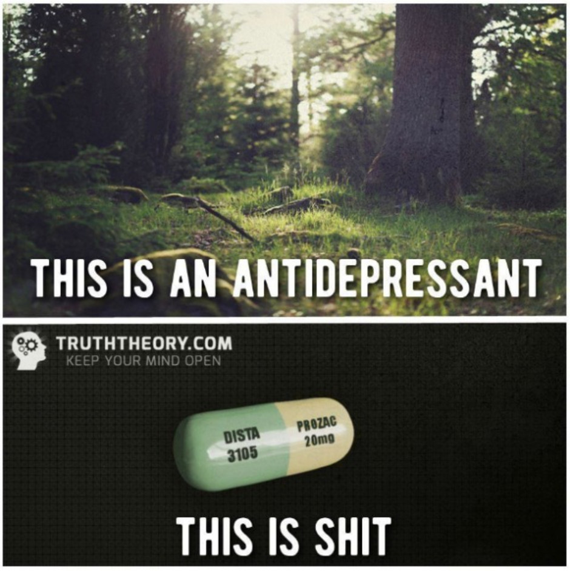
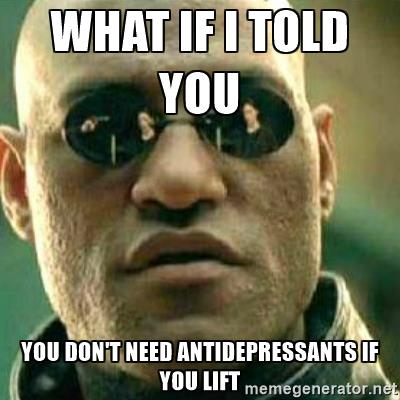
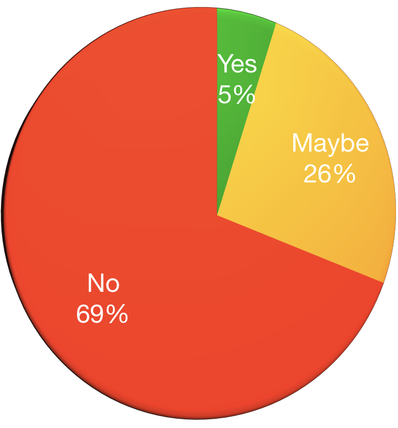

# Hello!

Note:
I'm JD and I'm here to start a conversation.  For many of us, this will not be 
a comfortable conversation, but for many others, it may resonate.

Either way, I want to get you talking.

<!--s-->

## who the heck is this guy?
### OH YEAH, I HAVE MENTAL ILLNESSES<!-- .element: class="fragment" -->

Note:
You may be asking yourself, who is this random person?
- Drupal/PHP Developer for 6 years
- Doing HTML since the 90s
- MidCamp Organizer
- Drupal Chicago Meetup Organizer
- Paramedic/EMT/firefighter for 10 years

__FRAGMENT__
- I also have mental illnesses

And my goal is to talk with you about...
<!--s-->

# ERASING THE STIGMA
## MENTAL ILLNESS IN TECH

J.D. Flynn

@JDDoesDev #OSMI

<!--s-->
### Disclaimer:
## NOT a doctor<!-- .element: class="fragment" -->

Note:
- Disclaimer:  I'm not a mental or medical health professional nor am I here to give medical advice
- I am someone with mental illnesses - plural
  - Here to talk with us about us
- I've experienced difficulties in both my personal and professional life because of my mental illnesses
- I was in denial for a very long time

<!--s-->
<!-- .slide: data-background-color="#888f79" -->

# WHY TALK ABOUT THIS?

Note:
- For one, to start the conversation.
  - Why?  People don't want to talk about mental illness.
- Share some resources and statistics
- I've seen firsthand what untreated mental illness can do

<!--s-->
<!-- .slide: data-background-color="#888f79" -->

## It's kind of a big deal

Note:
Mental illness represents the biggest economic burden of any health issue in the world, costing 2.5 trillion in 2010 and that number is only going up.

But above all else...

<!--s-->
<!-- .slide: data-background-color="#888f79" -->

# **IT NEEDS TO BE TALKED ABOUT**

Note:
- The conversation needs to be started
- The stigma needs to be erased and the first step is starting the conversation.
  - This is why I'm here today

<!--s-->

## WHY SHOULD THIS BE IMPORTANT TO YOU?

Note:
1 in 5 adults in the US experience mental illness in a given year - NAMI.org
We're going to find out later, that number is higher in the tech community.

<!--s-->

## WHY IS THIS IMPORTANT TO ME?
### _**I'm not weak; I'm sick**_ <!-- .element: class="fragment" -->

Note:
- As I mentioned, I have mental illness
- I suffered in silence
  - For a very long time I was in denial.  I was afraid that admitting I had an illness would make it real
  - Also victim of the stigma.  i thought mental illness meant someone was damaged or defective and i didn't want to be either
- Perfect health until doctor tells you otherwise
- I worried that if I told people they would treat me differently

fragment - Something that I often need to tell myself

<!--s-->

# WHAT IS MENTAL ILLNESS?

Note:
- Mental illness refers to a wide range of mental health conditions — disorders that affect your mood, thinking and behavior. - Mayo Clinic

<!--s-->
<!-- .slide: data-background-color="#360101" -->

### TIME TO GET UNCOMFORTABLY PERSONAL
- Major Depression <!-- .element: class="fragment" -->
- Anxiety Disorder <!-- .element: class="fragment" -->
- PTSD <!-- .element: class="fragment" -->
- ADHD <!-- .element: class="fragment" -->

Note:
- Clinical depression is marked by a depressed mood most of the day, sometimes particularly in the morning, and a loss of interest in normal activities and relationships -- symptoms that are present every day for at least 2 weeks - WebMD
- Anxiety: A mental health disorder characterized by feelings of worry, anxiety, or fear that are strong enough to interfere with one's daily activities - Mayo Clinic
- PTSD: A disorder characterized by failure to recover after experiencing or witnessing a terrifying event - Mayo Clinic
- ADHD disorder that is characterized by varying degrees of hyperactivity, impulsivity, and/or inattention that lead to difficulty in academic, emotional, and social functioning.
  - When I was a kid, this was often looked at as being a bit odd or just needing to burn off some energy

But I wasn't always diagnosed, so what changed?

<!--s-->
<!-- .slide: data-background-color="#675b53" -->
## I accepted something was wrong

Note:
- The first step was the hardest.
- People weren't affected by everyday things like I was and I had an epiphany that maybe everything else wasn't the issue. Maybe it was me?
  - if everywhere you go smells like dog crap, maybe you should look at your own shoes
- For a lot of people (including myself) this is the hardest part
- So then...

<!--s-->
<!-- .slide: data-background-color="#675b53" -->

# I GOT TREATMENT

Note:
- I go to therapy
- I take medication
  - Better living through chemistry
- I find creative outlets. 
- I start the conversation

I'm not shy about talking about it.  If someone wants to take issue with it, then that's on them.

<!--s-->
<!-- .slide: data-background-color="#675b53" -->

## WHAT WAS LIFE LIKE BEFORE I SOUGHT TREATMENT?

Note:
- In a word, difficult.  

<!--s-->
<!-- .slide: data-background-color="#675b53" -->

## WHAT WAS LIFE LIKE BEFORE I SOUGHT TREATMENT?
### Constantly afraid

Note:  Also mention:
- Paranoid about everything
- crippling fear of everyday things
- Social situations were paralyzing
- canceled plans a lot
- and that led me to feeling...

<!--s-->
<!-- .slide: data-background-color="#675b53" -->

## WHAT WAS LIFE LIKE BEFORE I SOUGHT TREATMENT?
### Alone

Note:
- i was alone because i canceled plans and made myself alone
- Always feel like people are looking at me for any flaws

<!--s-->
<!-- .slide: data-background-color="#675b53" -->
## WHAT WAS LIFE LIKE BEFORE I SOUGHT TREATMENT?
### Angry

Note:
- I was not a happy person and anything could set me off
- Mix of high stress job (ambulance) and untreated anxiety and depression were not a good combination
  - and, like many people in public service, I was too proud to admit something was wrong
  - Unlike too many people, I sought treatment

<!--s-->
<!-- .slide: data-background-color="#675b53" -->

## WHAT WAS LIFE LIKE BEFORE I SOUGHT TREATMENT?
### Misunderstood

Note:
- People often thought I was angry when I was terrified or just trying not to screw up

<!--s-->

## How has treatment affected me?

Note:
- I'm not ashamed of who I am
- The valleys aren't as deep
  - Not to say they aren't around anymore or that I don't have deep valleys, but they are much less frequent than before.
- My anxiety has gone down, but still rears its ugly head occasionally
- Since getting on medication and seeing a therapist,
  - I've become more comfortable in social situations,
  - still introverted,
  - I don't have nearly as many anxiety attacks or times when I am unreasonably afraid of doing normal things
- I am not as afraid of losing my job because of being unable to focus
- Also, i realize...

<!--s-->
<!-- .slide: data-background-color="#008e7f" -->

# WE'RE NOT ALONE

Note:
- Since getting treatment and getting past my own stigmas I've realized I'm not alone
- I realized that I was afraid because of the way people viewed me
- I don't feel that way anymore because of organizations like OSMI

<!--s-->

## WHY TECH SPECIFICALLY?

Note:  
Although it was suspected that there was a higher incidence of mental illness in the tech community, there was no specific tech community research done.  Sites like devpressed.com (now OSMI forums) and word of mouth were all there were to go on

Studies have shown an increased incidence of mental illness, specifically anxiety and depression, in people with above average IQs.  Suggests intelligent people with "hyper brains" are more reactive to environmental stimulus and that “may predispose them to certain psychological disorders as well as physiological conditions involving elevated sensory and altered immune and inflammatory responses".

## IMPOSTER SYNDROME
- The feeling that you don't deserve to be doing what you're doing
- Give example of how you deal with it/are dealing with it.  Mention that it's common with people on FED slack.
- inability to take compliments

<!--s-->

## Question Time

<!--s-->
<!-- .slide: data-background-color="#675b53" -->

## Who has ever told someone with glasses or contacts to try looking harder?

<!--s-->
<!-- .slide: data-background-color="#675b53" -->

## Who has ever told someone with diabetes or a heart condition to stop taking their medicine?

<!--s-->
<!-- .slide: data-background-color="#675b53" -->

## Who has ever asked someone in a wheelchair if they really need the help?

<!--s-->
<!-- .slide: data-background-color="#675b53" -->

## Now replace every injury or disease in those questions with a mental illness
<!--s-->
<!-- .slide: data-background-color="#675b53" -->

### Images like this

<!--s-->
<!-- .slide: data-background-color="#675b53" -->

### And this...

<!--s-->
<!-- .slide: data-background-color="#675b53" -->

## They all pretty much say the same thing

Note:
- You're not trying hard enough
- Personally, I can vouch for the effects of medication for me
  - Everyone is different and what works for me may not work for the next person
  - I don't shame anyone for taking a different path to health than me

<!--s-->

### But remember...

Note:
- Remember those questions earlier?
<!--s-->

## So how do we Erase the Stigma?

Note:
We need to be...

<!--s-->

# __STRONGER THAN FEAR__
<!-- .slide: data-background="./img/osmi_logo.png" data-background-size="contain" -->

Note:
- Start the conversation
- Listen
- If someone trusts you enough to talk about their mental health, listen.  
- Let people know they matter
- As someone with a disability, hearing an affirmation can do amazing things
- Don't be ashamed
- If you have a mental illness, you're not damaged; you have a disease
- Be respectful
- If you do feel that you have a disease, get treatment!
<!--s-->

## But what about the workplace?

Note: 
My anecdotes are one thing, but how are employees and employers affected?

<!--s-->

## Let's see what the data says!

<!--s-->
<!-- .slide: data-background="./img/osmi_logo.png" data-background-size="contain" -->

## Mental Health in Tech 2017 Survey Results

[osmihelp.org/research](osmihelp.org/research)

Note: This survey was done by OSMI and had approximately 800 responses.  The survey was made available to several different communities.  All responses are self-reported.

<!--s-->

<!-- .slide: class="chartSlide" -->
Would you bring up a _PHYSICAL_ health issue with a potential employer at an interview?

 

Note: Almost twice as many say "NO"
<!--s-->

<!-- .slide: class="chartSlide" -->
Would you bring up a _MENTAL_ health issue with a potential employer at an interview?

 

Note: Almost twice as many say "NO"

<!--s-->

<!-- .slide: class="chartSlide" -->
Do you feel that being identified as a person with a mental health issue would hurt your career? (2016)

 

Note: Only 12% say "no".  That speaks volumes to me.
- This is something I worry about every time I give this talk, but it is kind of freeing knowing that all my cards are on the table

<!--s-->
<!-- .slide: class="chartSlide" -->
Have you been diagnosed with a mental health condition?

Note:  
- This is self reported
- Average is around 20%
- 800 responses
<!--s-->
## As of 2015 _17.9%_ of _All_ U.S. Adults had some form of Mental Illness

Note:
"In 2015, there were an estimated 43.4 million adults aged 18 or older in the United States with any mental illness within the past year. This number represented 17.9% of all U.S. adults." - National Institute of Mental Health

- AMI - Any mental illness

<!--s-->
<!-- .slide: data-background-color="#888f79" -->

## What do these figures mean?
<!--s-->
<!-- .slide: data-background-color="#360101" -->

# We're afraid to talk about mental illness

<!--s-->
<!-- .slide: data-background-color="#360101" -->

## Why are we afraid?  It's because of the stigma.

<!--s-->

## We're afraid that being honest will have negative consequences

For many of us, this means suffering in silence

Note:  
- We're afraid coworkers will change their opinion of us
- Especially as someone with anxiety, worrying what people think can really affect you
- Some of our minds go straight to the worst case scenario

<!--s-->

## We're afraid we might get sent to the ~~principal's&nbsp;office~~ HR Department

Note: Mention how it took you a lot to build up the courage to tell your bosses about your illness only to get a call from HR.  From people you deal with every day to someone who might as well be a stranger.

<!--s-->

## Why should a workplace care?

Note:
- depression alone impacts an estimated 9.5 percent of the American adult population. 
- estimated to cause 200 million lost work days each year 
  -  costing employers up to $44 billion annually
<!--s-->

# So what can we do?

<!--s-->

## Fight ignorance with information

Note: mention the exit interview and sending a link to OSMI
- Mental Health First Aid class - great for HR, managers, or anyone

<!--s-->
## Get the OSMI handbooks

## http://bit.ly/osmi-books

Note:  Not trying to sell anything, but the books are DRM free and extremely useful
 - Mental Health in Tech: Guidelines for Mental Wellness in the Workplace
 - Mental Health in Tech: Guidelines for Executives and HR Professionals
 - Mental Health in Tech: Guidelines for Employees
<!--s-->
<!-- .slide: data-background-color="#008e7f" -->

## In tech and development, community is our greatest resource

Note:
Time to bring it home --
Especially in open source communities

<!--s-->
<!-- .slide: data-background-color="#008e7f" -->

## *__43%__* of survey respondents claimed mental illness diagnoses

Note: So what does that mean?

<!--s-->
<!-- .slide: data-background-color="#008e7f" -->

# We are not alone

<!--s-->
<!-- .slide: data-background-color="#008e7f" -->

# We are not damaged

Note: And with a little work, together we can....

<!--s-->

# Erase the stigma
<!-- .slide: data-background="./img/osmi_logo.png" data-background-size="contain" -->

Note: and become
<!--s-->

# Stronger than Fear
<!-- .slide: data-background="./img/osmi_logo.png" data-background-size="contain" -->

<!--s-->

#### Some resources available:
- osmihelp.org
- Find a therapist: 1-800-THERAPIST
- Psychologytoday.com
- National Association on Mental Illness: 1-800-950-NAMI
- Suicide Lifeline: 1-800-273-8255

<!--s-->

## Thank you for listening

<!--s-->

# Questions?

<!--s-->
