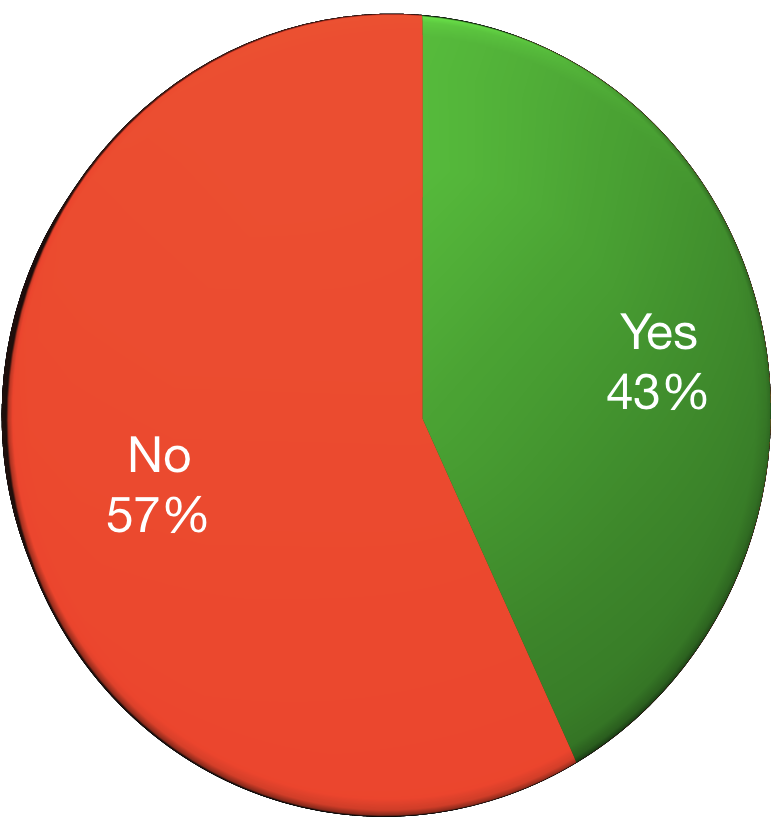
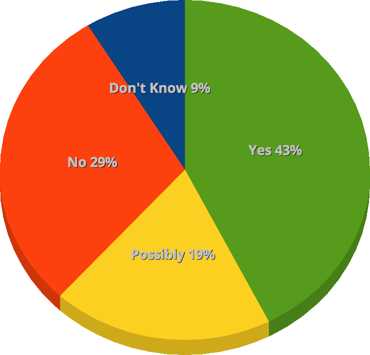
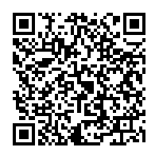

# Hello!

Note:

<!--s-->

## who the heck is this guy?
### OH YEAH, I HAVE MENTAL ILLNESSES<!-- .element: class="fragment" -->

Note:
You may be asking yourself, who is this random person?
- Drupal/PHP Developer for 6 years
- Doing HTML since the 90s
- MidCamp Organizer
- Drupal Chicago Meetup Organizer
- Paramedic/EMT/firefighter for 10 years

__FRAGMENT__
- I also have mental illnesses

And my goal is to talk with you about...

<!--s-->
# ERASING THE STIGMA
## MENTAL HEALTH AND WELLNESS IN TECH

J.D. Flynn, Drupal Technical Architect at Genuine

@JDDoesDev • Slack(s): Dorf

MidCamp • #MidCamp • #OSMI

Note:
Welcome everyone!  Thank you for being here and taking part!

<!--s-->

### Disclaimers:
## NOT a doctor<!-- .element: class="fragment" -->
## IT's okay to laugh<!-- .element: class="fragment" -->
## Possible naughty language<!-- .element: class="fragment" -->

Note:
- Disclaimer:  I'm not a mental health professional nor am I here to give medical advice
- I am someone with mental illnesses - plural
- I've experienced difficulties in the workplace and in my personal life because of my mental illnesses
- I was in denial for a very long time
- It's fine to laugh about it and not be insulting
- I also tend to swear without thinking about it... sorry

<!--s-->
<!-- .slide: data-background-color="#888f79" -->

# WHY TALK ABOUT THIS?

Note:
There are a few reasons I do this talk.
- Remote work is hard for some people
  - Also a better option for many people
- In office work is also difficult for introverts
  - Not much opportunity for "recharge" time

<!--s-->
<!-- .slide: data-background-color="#888f79" -->

## WE'RE NOT ALONE

Note:
- You're not the only one going through this.
- I'm still having a hard time dealing with this fact

<!--s-->
<!-- .slide: data-background-color="#888f79" -->

# **IT NEEDS TO BE TALKED ABOUT**

Note:
- I start the conversation
- Part of the stigma is being afraid to talk about it
- And you people are here.  You're taking the right steps.  Even if you don't have mental illness yourself, thank you!

<!--s-->

## WHY SHOULD THIS BE IMPORTANT TO YOU?

Note:
- Approximately 20% of adults in the US experience mental illness in a given year - NAMI.org
- We're going to find out later, that number is higher in the tech community.

<!--s-->

## WHY IS THIS IMPORTANT TO ME?
### _**I'm not weak; I'm sick**_ <!-- .element: class="fragment" -->

Note:
- As I mentioned, I have mental illness
- I suffered in silence
  - For a very long time I was in denial.  I was afraid that admitting I had an illness would make it real
  - Also victim of the stigma.  i thought mental illness meant someone was damaged or defective and i didn't want to be either
- I worried that if I told people they would treat me differently

fragment - Something that I often need to tell myself.  Not defective or damaged, I have a disease.

<!--s-->
<!-- .slide: data-background-color="#675b53" -->
## ABOUT YOU

### AKA Unexpected audience participation

Note:
You're going to learn a lot about me, so I'd like to learn a little about you
- How many of you are developers or here to learn development, themers, site builders, designers, or anything directly related to making sites?
- How many of you are project managers, owners, or account managers or similar
- How many of you are in HR?
- How many of you are in upper management? Managers, Presidents, CEOs, etc.
- How many of you work remotely?
- How many of you work in office?
- How many of you work a hybrid?

<!--s-->

# WHAT IS MENTAL ILLNESS?

Note:
- Mental illness refers to a wide range of mental health conditions — disorders that affect your mood, thinking and behavior. - Mayo Clinic

<!--s-->
<!-- .slide: data-background-color="#360101" -->

### TIME TO GET UNCOMFORTABLY PERSONAL
- Major Depression <!-- .element: class="fragment" -->
- Anxiety Disorder <!-- .element: class="fragment" -->
- PTSD <!-- .element: class="fragment" -->
- ADHD <!-- .element: class="fragment" -->
- TBD (One away from BINGO!) <!-- .element: class="fragment" -->

Note:
- Clinical _depression_ is marked by a _depressed mood most of the day_, sometimes particularly in the morning, and a _loss of interest_ in normal activities and relationships -- symptoms that are present _every day_ for at _least 2 weeks_ - WebMD
- Anxiety: A mental health disorder characterized by feelings of _worry, anxiety, or fear_ that are strong enough to _interfere with_ one's _daily activities_ - Mayo Clinic
- PTSD: A disorder characterized by _failure to recover_ after experiencing or witnessing _a terrifying event_ - Mayo Clinic
  - Consider mentioning some ambulance things, firefighter things, and generalize childhood.  Give the "RAM v HDD" metaphor
- ADHD disorder that is characterized by varying degrees of hyperactivity, impulsivity, and/or inattention that lead to difficulty in academic, emotional, and social functioning.
  - When I was a kid, this was often looked at as being a bit odd or just needing to burn off some energy

<!--s-->
<!-- .slide: data-background-color="#675b53" -->

## WHAT WAS LIFE LIKE BEFORE I SOUGHT TREATMENT?

Note:
- In a word, difficult.

<!--s-->
<!-- .slide: data-background-color="#675b53" -->

## WHAT WAS LIFE LIKE BEFORE I SOUGHT TREATMENT?
### Constantly afraid

Note:  Also mention:
- Paranoid about everything
- crippling fear of everyday things
- Social situations were paralyzing
- canceled plans a lot
- and that led me to feeling...

<!--s-->
<!-- .slide: data-background-color="#675b53" -->

## WHAT WAS LIFE LIKE BEFORE I SOUGHT TREATMENT?
### Alone

Note:
- i was alone because i canceled plans and made myself alone
- Feel alone in crowded spaces
  - self imposed isolation
- Always feel like people are looking at me for any flaws
- Example:  On the train i hope nobody sits next to me, but i wonder what's wrong with me when nobody sits next to me

<!--s-->
<!-- .slide: data-background-color="#675b53" -->
## WHAT WAS LIFE LIKE BEFORE I SOUGHT TREATMENT?
### Angry

Note:
- I was not a happy person and anything could set me off
- Mix of high stress job (ambulance) and untreated anxiety and depression were not a good combination
  - and, like many people in public service, I was too proud to admit something was wrong
  - Unlike too many people in PS, I sought treatment

<!--s-->
<!-- .slide: data-background-color="#675b53" -->

## WHAT WAS LIFE LIKE BEFORE I SOUGHT TREATMENT?
### Misunderstood

Note:
- People often thought I was angry when I was terrified or just trying not to screw up

<!--s-->
<!-- .slide: data-background-color="#675b53" -->
## I accepted something was wrong

Note:
- The first thing was the hardest. I saw other people living happy lives and not going through the same things I was.
- People didn't get as upset or angry about things the way that I did
- People weren't affected by everyday things like I was and I had an epiphany that maybe everything else wasn't the issue. Maybe it was me?
  - if everywhere you go smells like dog crap, maybe you should look at your own shoes
- For a lot of people (including myself) this is the hardest part
- So then...

<!--s-->
<!-- .slide: data-background-color="#675b53" -->

# I GOT TREATMENT

Note:
- I take medication
  - Better living through chemistry
- I see a therapist
- I find outlets.
  - Mention Windiana and MCMB
  - active in the Drupal community
- I start the conversation

Mention not being shy about talking about it.
People don't need to know the details of your PTSD, but that you're not afraid to mention it in social situations.
If other people are uncomfortable about it, that's their problem.  Mention something about talking openly at events.

<!--s-->
## How has treatment affected me?

Note:
- I'm not ashamed of who I am
  - Before, I wanted to hide in shame because of who I am and my conditions.  I've since realized that it's just part of me.  not too proud to admit i need help anymore
- The valleys aren't as deep
  - Not to say they aren't around anymore or that I don't have deep valleys, but they are much less frequent than before.
- My anxiety has gone down, but still rears its ugly head occasionally
- Since getting on medication and seeing a therapist,
  - I've become more comfortable in social situations,
    - I run a coffee shop with many, many customers
  - still introverted,
  - I don't have nearly as many anxiety attacks or times when I am unreasonably afraid of doing normal things
- I am not as afraid of losing my job because of being unable to focus
- Also, i realize...

<!--s-->
<!-- .slide: data-background-color="#008e7f" -->

# WE'RE NOT ALONE

Note:
- Since getting diagnosed and erasing stigma from myself I've realized I'm not alone
- I realized that I was afraid because of the way people viewed me
- I don't feel that way anymore because of organizations like OSMI

<!--s-->

## Challenges of Working Alone
## As Someone With Mental Illness <!-- .element: class="fragment" data-fragment-index="1" -->

Note:
- Remote/Hybrid working offers a new set of challenges for people with mental illness.
- AP: if some people work remotely ask what they think challenges are
  - "I know what I have a hard time with, what about you?"

<!--s-->

## Communication

`<Coworker> : Hey, why did you flergle the norflet like that?`
<!-- .element: class="fragment" data-fragment-index="1" -->

Note:
- Text based communication is difficult
- The voice you read messages in isn't necessarily the way it was meant
- Difficult to build rapport with people you hardly ever see

<!--s-->

## Isolation
 <!-- .element: class="fragment chart" data-fragment-index="1" -->

Note:
- It's easy to feel alone
- It's very easy to make yourself alone
- It's very easy to start talking to your animals
  - Worse, sometimes they start talking back.

<!--s-->

## Guilt

Note:
- Feel guilty for taking time off
- Easy to forget that you're not alone on a team.
- Hard to disconnect work from non-work life

<!--s-->

## Distractions

Note:
- Work or play Mario?
- Work or do dishes?
- Work or anything but work?

<!--s-->

## Sedentary Lifestyle
 <!-- .element: class="fragment chart" data-fragment-index="1" -->

Note:
- Not having to put on pants to go to work sounds great
  - Until you realize you haven't showered in days and your cat just isn't having it
- Not active because you don't need to leave the house
  - See Avi's talk from 10 minutes ago

<!--s-->

## So how do i avoid a stinky, isolated existence?

<!--s-->

## Trial & Error

Note:
- My second dev job was fully remote.
- I didn't figure out most of this for a long time
- A lot of this can be used for in-office as well
- Here are the things that work for me, and i'll offer a suggestion for in-office workers as well
<!--s-->

## Issue #1: Sedentary Lifestyle

 <!-- .element: class="fragment chart" data-fragment-index="1" -->

Note:
- Create your routine to at least simulate going to work
  - Shower, get dressed, brush teeth, deodorant, etc
  - This also helps get you in the right frame of mind for "going to work"
- In-office: GET AWAY FROM YOUR DESK!
  - Fresh air!
  - Do the stuff Avi talked about 10 minutes ago

<!--s-->

## Issue #2: Distractions

Note:
- If space allows, set a dedicated workspace
- Make sure your co-habitators know when you're working, you're working
  - You're not just hanging out
- Consider some signal that you're in "work mode"
  - Headphone rule
  - Light bulb
  - Locked door and disapproving stare
- In-office:
  - Headphone rule
  - Let your coworkers know if you're sprinting or going "heads down"

<!--s-->

## Issue #3: Guilt

Note:
- Just because you have work at home doesn't mean that you need to be working all the time
- When you need time off, take it
  - Your company will understand.  That's why you have sick time and PTO
  - When you take time off, DON'T DO WORK!
- It's okay to not be on your laptop all the time
- Get your work done, but don't compare your own speed or volume to others
- In-office:
  - Don't compare yourself to others.
  - Everyone has their own strengths
  - It's okay to leave on time (Fire drills aside)

<!--s-->

## Issue #4: Isolation

Note:
- Use your team's tools to feel more included
  - Slack, Teams, AIM, ICQ, Skype, Phone
- Find time to make human contact
  - Sometimes I need to be around people just for the sake of ignoring them
  - Volunteer for things or join a club
  - Work from a local independent coffee shop
- In-office:
  - When you're not in "heads down" mode, get to know your coworkers or office-mates
  - Introduce yourself to new people
- Join communities
  - FED Discord, local user group slacks, etc.

<!--s-->

## Issue #5: Communication

Note:
- Said before, use your team's tools
- Find time for face time
  - Schedule check-ins
  - Talk over an issue instead of chatting about it
- Ask questions about meaning
- In-office:
  - Take conversations offline sometimes

<!--s-->

## What's mental health got to do, got to do with it?

<!--s-->
<!-- .slide: data-background="./img/osmi_logo.png" data-background-size="contain" -->

## Survey Says:

<!--s-->
<!-- .slide: class="chartSlide" -->

Have you been diagnosed with a mental health condition?

 <!-- .element: class="fragment chart" -->

Note:
- This is self reported
- Average is around 20%
- 800 responses

<!--s-->
<!-- .slide: class="chartSlide" -->
Do you _Think_ you have a mental health condition?

 <!-- .element: class="fragment chart" -->

Note:
- This is self reported
- Average is around 20%
- 800 responses
- includes people who answered yes to diagnosed

<!--s-->
<!-- .slide: data-background-color="#888f79" -->

## Those of us with mental illness handle things differently

Note:
- Some of us have a hard time breaking out of the isolation
- Anxiety + text based communication = a lot of oh shit moments

<!--s-->

## We're afraid that taking time to ourselves will have negative consequences

For many of us, this means suffering in silence

Note:
- "Sure, I'll get it done in a half day"
- We're afraid coworkers will change their opinion of us for taking to ourselves
- Especially as someone with anxiety, worrying what people think can drive you mad
- Some of our minds go straight to the worst case scenario
- Mention email of "we need to talk" on 89th day of 90 day probation and "password incorrect" email error
- Binary mind

<!--s-->

## As of 2015 _17.9%_ of _All_ U.S. Adults had some form of Mental Illness

Note:
"In 2015, there were an estimated 43.4 million adults aged 18 or older in the United States with any mental illness within the past year. This number represented 17.9% of all U.S. adults." - National Institute of Mental Health

- AMI - Any mental illness

<!--s-->

## Why should a workplace care?

Note:
- depression alone impacts an estimated 9.5 percent of the American adult population.
- estimated to cause 200 million lost work days each year
  - costing employers up to $44 billion annually

<!--s-->

## How can a workplace help?

Note:
- open lines of communication
- management schedule check-ins
- be more inclusive with remote workers if hybrid
- Understand mental illness concerns and how to accommodate
  - Difficult because someone with a mental illness may not want to disclose
  - Not protected unless you disclose
- If a workplace is prepared and educated to deal with this particular disability, an employee may feel more comfortable being open about it if they need time off.
- I had times when I would show up or log in and do nothing for days, but still log time, because I was afraid of going to my boss.
- Can't say for sure, but if I had felt comfortable saying "Hey, I need a day/afternoon" I could have recharged a bit and possibly not have wasted so much time.

<!--s-->

## In summary

You can work remotely and not end up with a grumpy cat

<!--s-->

## Take the OSMI 2018 Survey

## https://osmihelp.org/research

<!--s-->

## Get the OSMI handbooks

## http://bit.ly/osmi-books

Note:  Not trying to sell anything, but the books are DRM free and extremely useful
 - Mental Health in Tech: Guidelines for Mental Wellness in the Workplace
 - Mental Health in Tech: Guidelines for Executives and HR Professionals
 - Mental Health in Tech: Guidelines for Employees
<!--s-->

## Seriously, Take the OSMI 2018 Survey

## https://osmihelp.org/research

<!--s-->
<!-- .slide: data-background-color="#008e7f" -->

## In open source tech, community is our greatest resource

Note:
Time to bring it home --
Especially in open source communities

<!--s-->
<!-- .slide: data-background-color="#008e7f" -->

# We are not alone

<!--s-->
<!-- .slide: data-background-color="#008e7f" -->

# We are more than usernames

Note:
Something that events like this help remind us of

<!--s-->
<!-- .slide: data-background-color="#008e7f" -->

# We are real people

Note:
Look around.  We're not 1s and 0s.  We're actually here interacting

<!--s-->

# Erase the stigma
<!-- .slide: data-background="./img/osmi_logo.png" data-background-size="contain" -->

<!--s-->

#### Some resources available:
- osmihelp.org
- Find a therapist: 1-800-THERAPIST
- Psychologytoday.com
- National Association on Mental Illness: 1-800-950-NAMI
- Suicide Lifeline: 1-800-273-8255

<!--s-->

## Thank you for listening

<!--s-->

### Survey at http://bit.ly/jdf-survey

<!--s-->

# Questions?

<!--s-->
