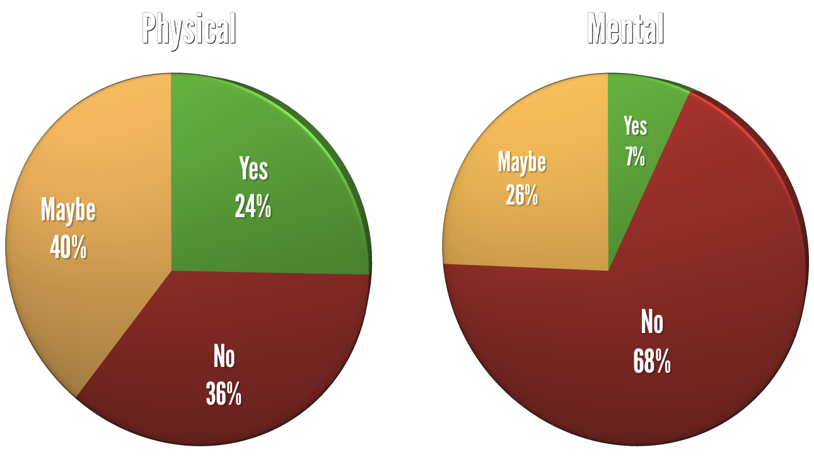
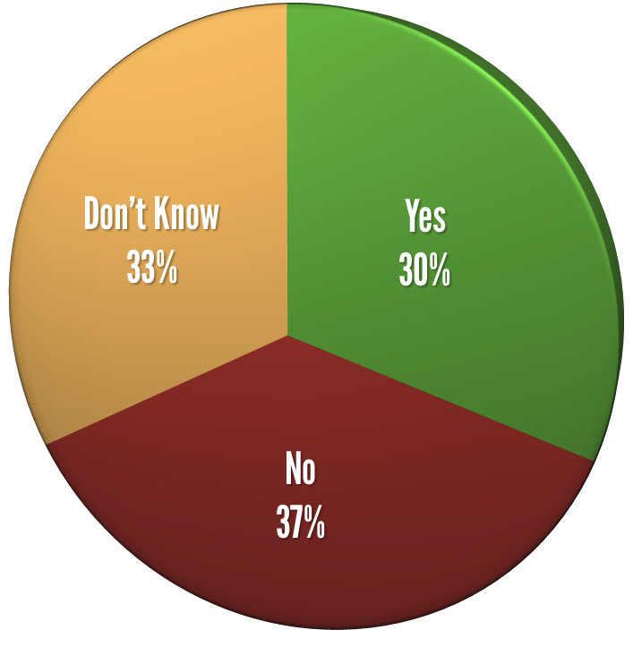
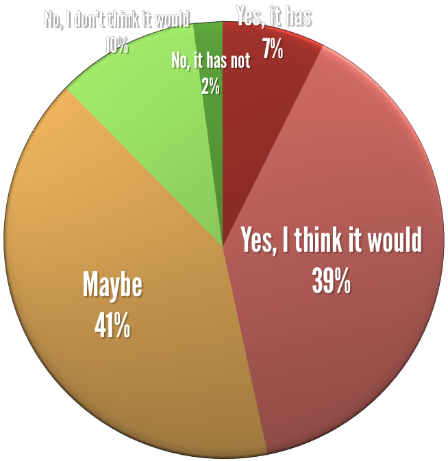
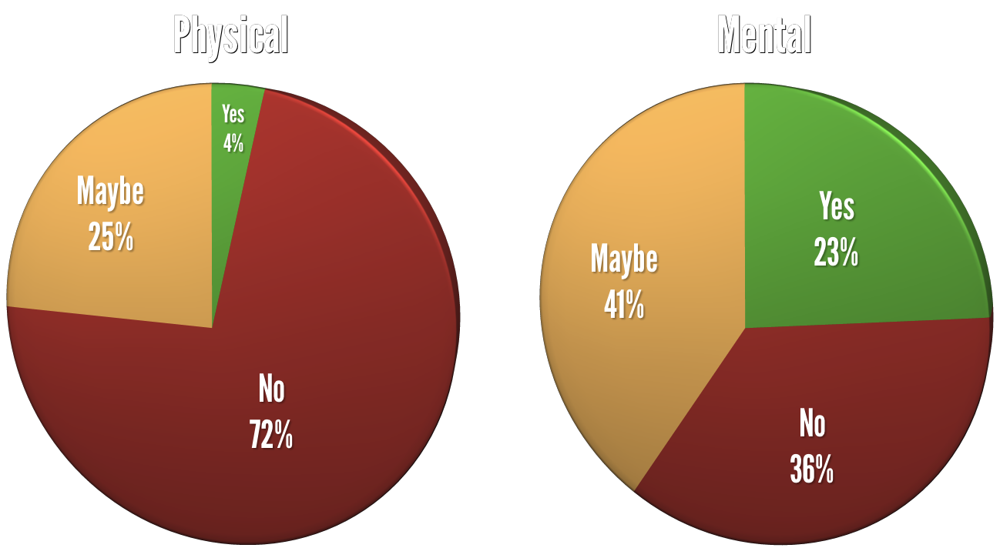
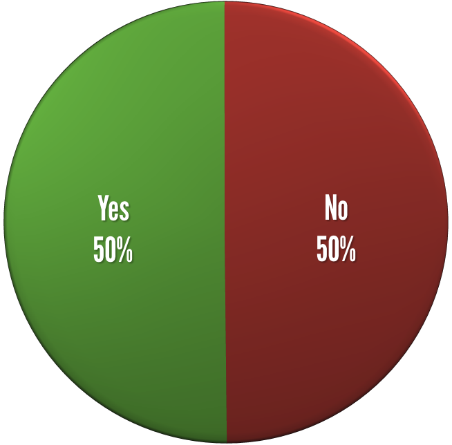
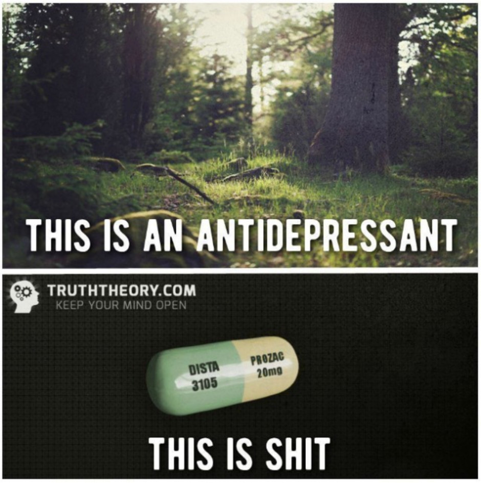
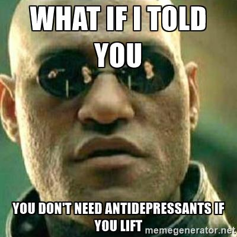
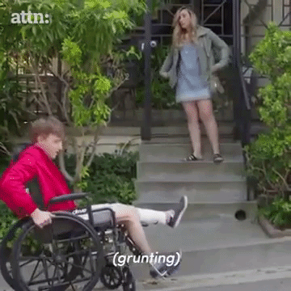

# ERASING THE STIGMA
## YOU'RE NOT ALONE

J.D. Flynn, Drupal Technical Architect at Blast Radius

@JDDoesDev • D.O: Dorficus • Slack: Dorf

Twin Cities Drupal Camp • #tcdrupal • #osmi

<!--s-->

# ABOUT ME

Note:
- Name
- Drupal/PHP Developer for 4 years
- Doing HTML since the 90s
- Midcamp Organizer
- Paramedic for 10 years

<!--s-->

## I am not a mental health professional.  I am just a guy trying to open the conversation by telling my story.

Note: Preface the rest of this with a disclaimer

<!--s-->

# ABOUT THIS SESSION

Note: There are a few things that I want to accomplish with this talk.
- Open up the conversation about mental illness
  - This is pretty important.  People don't want to talk about mental illness.
- Share some resources and statistics
- Share some experiences, both personal and professional
- Try out public speaking

This should be focused on why you're doing this talk, not why you're talking about it
Also, take a first-time selfie

<!--s-->

# QUESTION TIME

### AKA Unexpected audience participation

Note:  This is where you ask about
- developers, PMs, HR
- diabetes, HTN, flu, etc

<!--s-->

# How many of you are developers?

Note: Or themers, or site builders, or anything directly related to the tech

<!--s-->

# How many of you are project managers?

Note: or account managers or similar

<!--s-->

# How many of you are in HR?

<!--s-->

# How many of you are in upper management?

Note: Managers, Presidents, CEOs, etc.

<!--s-->

# WHY TALK ABOUT THIS?

Note:
- Paramedic for 10 years, EMT and firefighter before that
- I've seen firsthand what untreated mental illness can do
- Consider anecdotes from the ambulance, but nothing too drastic or depressing.
- And because...

<!--s-->

# I have mental illness

Note: And because...

<!--s-->

## Burden of mental disorders is the _largest_ of all disorder categories in North America - WHO 2008

Note: But above all else...
<!--s-->

# **IT NEEDS TO BE TALKED ABOUT**

Note:
- The conversation needs to be started
- The stigma needs to be erased

<!--s-->

# WHY IS THIS IMPORTANT TO ME?

<!--s-->

## I have mental illness

Note:  As I mentioned before, I have mental illnesses

<!--s-->

## I suffered in silence

Note: For a very long time I was in denial.  I was afraid that admitting I had an illness would make it real
- Perfect health until doctor tells you otherwise

<!--s-->

## When I tell people, sometimes they treat me differently

Note: Sometimes they walk or back away, sometimes they start treating me more delicately.  No need to walk on eggshells around me.

<!--s-->

## _**I'm not defective; I have a disease**_

Note:
- Definitely focus on it not being a personality quirk, but illness

<!--s-->

# TIME TO GET UNCOMFORTABLY PERSONAL

<!--s-->

## Major Depression

Note: Clinical _depression_ is marked by a _depressed mood most of the day_, sometimes particularly in the morning, and a _loss of interest_ in normal activities and relationships -- symptoms that are present _every day_ for at _least 2 weeks_ - WebMD

<!--s-->

## Anxiety Disorder

Note: A mental health disorder characterized by feelings of _worry, anxiety, or fear_ that are strong enough to _interfere with_ one's _daily activities_ - Mayo Clinic

<!--s-->

## PTSD

Note:
- A disorder characterized by _failure to recover_ after experiencing or witnessing _a terrifying event_ - Mayo Clinic
- Consider mentioning some ambulance things, firefighter things, and generalize childhood.  Give the "RAM v HDD" metaphor

<!--s-->

# What changed?

<!--s-->

# I GOT TREATMENT

@TODO: More slides?
Note:
- I take medication
  - Better living through chemistry
- I see a therapist
  - I'm currently between therapists, but looking.  Turns out Indiana isn't full of reputable therapists
- I find outlets. Mention community band, becoming active in the community through teaching
- I start the conversation
Mention not being shy about talking about it.
People don't need to know the details of your PTSD, but that you're not afraid to mention it in social situations.
If other people are uncomfortable about it, that's their problem.  Mention something about talking openly at events.

<!--s-->

# WHAT WAS LIFE LIKE BEFORE I SOUGHT TREATMENT?

<!--s-->

## Difficult

Note: In a word, difficult.  Afraid to see a therapist because I thought that would make it real.

<!--s-->

## Deep, deep valleys

Note:
- I mess up everything I touch
- Small losses overshadow huge wins

<!--s-->

## Complete inability to focus

Note:  Also mention:
- constantly in fear of losing my job because of reduced output due to depression
- spent a lot of time trying to figure out what was wrong with me

<!--s-->

## Afraid

Note:  Also mention:
- crippling fear of everyday things
- @todo some more examples of anxiety fear
<!--s-->

## Alone

Note:
- Feel alone in crowded spaces
- Always feel like people are looking at me for any flaws
- Example:  On the train i hope nobody sits next to me, but i wonder what's wrong with me when nobody sits next to me

<!--s-->

# How has treatment affected me?

<!--s-->

## The valleys aren't as deep
Note: Not to say they aren't around anymore or that I don't have deep valleys, but they are much less frequent than before.

<!--s-->

## I'm not ashamed of who I am
Note: Before, I wanted to hide in shame because of who I am and my conditions.  I've since realized that it's just part of me.

<!--s-->

## My anxiety has gone down, but still rears its ugly head occasionally

Note: Since getting on medication and seeing a therapist, I've become more comfortable in social situations, although still introverted, and I don't have nearly as many anxiety attacks or times when I am unreasonably afraid of doing something that other people find normal

<!--s-->

## Not alone

Note:
- Since getting diagnosed and erasing stigma from myself I've realized I'm not alone
- I realized that I was afraid because of the way people viewed me
- I don't feel that way anymore because of organizations like OSMI

<!--s-->

# WHAT IS MENTAL ILLNESS?

Note: Now I've been going on for a while about how mental illness has affected me, but what is mental illness?

<!--s-->

Mental illness refers to a _wide range_ of _mental health_ conditions — disorders that affect _your mood, thinking and behavior_. Examples of mental illness include _depression, anxiety disorders, schizophrenia, eating disorders and addictive behaviors_. - Mayo Clinic

<!--s-->

# SEVERE LACK OF RESEARCH

Note:  Although it was suspected that there was a higher incidence of mental illness in the tech community, there was no specific tech community research done.  Sites like devpression.com and word of mouth were all there were to go on

<!--s-->

## FORTUNATELY, we don't have to rely on speculation anymore... The research has been done!

Note: And is still being done

<!--s-->

<!-- .slide: data-background="./img/osmi_logo.png" data-background-size="contain" -->

## Mental Health in Tech 2016 Survey Results

As of 11/16/2016, US Residents, Non-self-employed

[osmihelp.org/research](osmihelp.org/research)

Note: This survey was done by OSMI and had approximately 1500 responses.  The survey was made available to several different communities.  All responses are self-reported.

<!--s-->

<!-- .slide: class="chartSlide" -->
Would you bring up a health issue with a potential employer at an interview?

 <!-- .element: class="fragment chart" data-fragment-index="1" -->

Note: Almost twice as many say "NO"
<!--s-->

<!-- .slide: class="chartSlide" -->
Does your employer provide resources to learn more about mental health issues and how to seek help?

 <!-- .element: class="fragment chart" data-fragment-index="1" -->

Note: Only 30% can say with any certainty that they know there are resources, but the highest percentage says no.  Does not include insurance coverage.

<!--s-->

<!-- .slide: class="chartSlide" -->
Do you feel that being identified as a person with a mental health issue would hurt your career?

 <!-- .element: class="fragment chart" data-fragment-index="1" -->

Note:  Only 12% say "no".  That speaks volumes to me.

<!--s-->

<!-- .slide: class="chartSlide" id="surveySlides" -->
Do you think discussing a health issue with your employer would have negative consequences?

 <!-- .element: class="fragment chart" data-fragment-index="1" -->

Note: Over 5x more think that there would _definitely_ be negative consequences

<!--v-->

[back](#/backSlide)

<!--s-->

<!-- .slide: class="chartSlide" -->
Have you been diagnosed with a mental health condition?

 <!-- .element: class="fragment chart" -->

Note:  
- This is self reported
- Average is around 20%
- 1500 responses
-
<!--s-->

For comparison: "In 2015, there were an estimated 43.4 million adults aged 18 or older in the United States with AMI within the past year. This number represented 17.9% of all U.S. adults." - National Institute of Mental Health

Note:
- AMI - Any mental illness

<!--s-->

# WHY IS MENTAL ILLNESS PREVALENT IN THE TECH COMMUNITY?
A few possible reasons:

Note:  These are my own theories and surveys.
<!--s-->

## IMPOSTER SYNDROME

The feeling that you don't deserve to be doing what you're doing

Note: Give example of how you deal with it/are dealing with it.  Mention that it's common with people on FED slack.
- inability to take compliments

<!--s-->

## ISOLATION

We're often put on projects by ourselves, work remotely, or have little interaction with coworkers

Note: Developers, at least the ones I've dealt with, are a certain kind of people.  Sometimes we don't always relate to others the way that we see them relating to each other.  Mention how remote work, although it allows flexibility, can cause feelings of isolation.
<!--s-->

## PERFECTIONISTS

Usually, we don't like to put out crap code. We prefer things to be perfect, but...

<!--s-->

## WORK NEVER ENDS

We have job security, but there are always bugs, feature requests, or any number of issues that keep projects from ever being complete.

Note:  By the time you get to a point where you think you're done and your issue queue is empty, it's time for a reskin or rebuild.  For those of us who are completionists, this can be really stressful

<!--s-->

## Regardless of the cause, one thing remains the same

<!--s-->

# We're afraid to talk about mental illness

<!--s-->

## Why are we afraid?  It's because of the stigma.

<!--s-->

# Who here has taken a sick day?

<!--s-->

## Who has been afraid to call off for injuries or infections?

Note: Injuries - broken bones, etc.
Infections - Flu, cough, cold, etc.

<!--s-->

## Who has ever told someone with glasses or contacts to try looking harder?

<!--s-->

## Who has ever told someone in a wheelchair that they should just get over it and walk?

<!--s-->

## Who has ever told someone with diabetes, high blood pressure, or a heart condition to stop taking their medicine?

<!--s-->

### Images like this

<!--s-->

### This...

<!--s-->

### And this...

<!--s-->

## They all pretty much say the same thing

Note:
- You're not trying hard enough
- Personally, I can vouch for the effects of antidepressants
- Remember those questions earlier?

<!--s-->

## What if people with physical health problems were treated the way people with mental health problems were treated?

<!--v-->

<!--v-->

<!--v-->

<!--v-->

Source:  ATTN: https://www.youtube.com/watch?v=Bor9xVnbIz8

<!--s-->

## So how do we Erase the Stigma?

<!--s-->

## We need to be...

<!--s-->

# __STRONGER THAN FEAR__
<!-- .slide: data-background="./img/osmi_logo.png" data-background-size="contain" -->

<!--s-->

# Start the conversation

<!--s-->

# Listen

Note: If someone trusts you enough to talk about their mental health, listen.  

<!--s-->

# Let people know they matter

Note: As someone with a disability, hearing an affirmation can do amazing things
- Ambulance anecdote

<!--s-->

# Don't be ashamed

Note: If you have a mental illness, you're not damaged; you have a disease

<!--s-->

# Be respectful

Note: You can't always tell who has a disability.  Try to be respectful of what you say or how you portray diseases.

If you do feel that you have a disease, get treatment!

<!--s-->

## This is all good for personal relationships, but what about the workplace?

Remember when we talked about it [here](#/surveySlides)?

<!--s-->

<!-- .slide: id="backSlide" -->
## We're afraid that being honest will have negative consequences

For many of us, this means suffering in silence

Note:  Possible anecdote about recent situation at old job.

<!--s-->

## We're afraid coworkers will change their opinion of us

Note: Especially as someone with anxiety, worrying what people think can drive you mad

<!--s-->

## Some of our minds go straight to the worst case scenario

Note:  
- Mention email of "we need to talk" on 89th day of 90 day probation and "password incorrect" email error at current job
- Binary mind
<!--s-->

## We're araid we might get sent to the ~~principal's&nbsp;office~~ HR Department

Note: Mention how it took you a lot to build up the courage to tell your bosses about your illness only to get a call from HR.  From people you deal with every day to someone who might as well be a stranger.

<!--s-->

## Why should a workplace care?

<!--s-->

## Ignorance kills productivity

## Reduced productivity kills the bottom line

Note:
- This goes both ways.  
- Before treatment I would have stretches where I didn't accomplish anything
- That would lead to anxiety about not getting anything done
- Job insecurity
- Management didn't know how to handle
- HR didn't want to hear

<!--s-->

# Fight ignorance with information

Note: mention the exit interview and sending a link to OSMI

<!--s-->

## Get the OSMI handbooks

# http://bit.ly/osmi-books <!-- .element: class="fragment" data-fragment-index="1" -->

Note:  Not trying to sell anything, but the books are DRM free and extremely useful

<!--s-->

## The tech community is our greatest resource

Note:
Time to bring it home --
Especially in open source communities

<!--s-->

## *__50%__* of survey respondents claimed mental illness diagnoses

Note: So what does that mean?

<!--s-->

# We are not alone

<!--s-->

# We are more than usernames

<!--s-->

# We are real people

<!--s-->

# We are not damaged

Note: And with a little work, together we can....

<!--s-->

# Erase the stigma
<!-- .slide: data-background="./img/osmi_logo.png" data-background-size="contain" -->

<!--s-->

#### Some resources available:
- osmihelp.org
- Find a therapist: 1-800-THERAPIST
- National Association on Mental Illness: 1-800-950-NAMI
- Suicide Lifeline: 1-800-273-8255

<!--s-->

### Special thanks to:
- OSMI
- Ed Finkler (@Funkatron) and everyone else on the OSMI Slack
- Everyone who helped me open the conversation
- TCDrupal

<!--s-->

# Thank you for listening

Slides available at https://slides.dorfs.website/mental-health/

<!--s-->

# Questions?

<!--s-->
