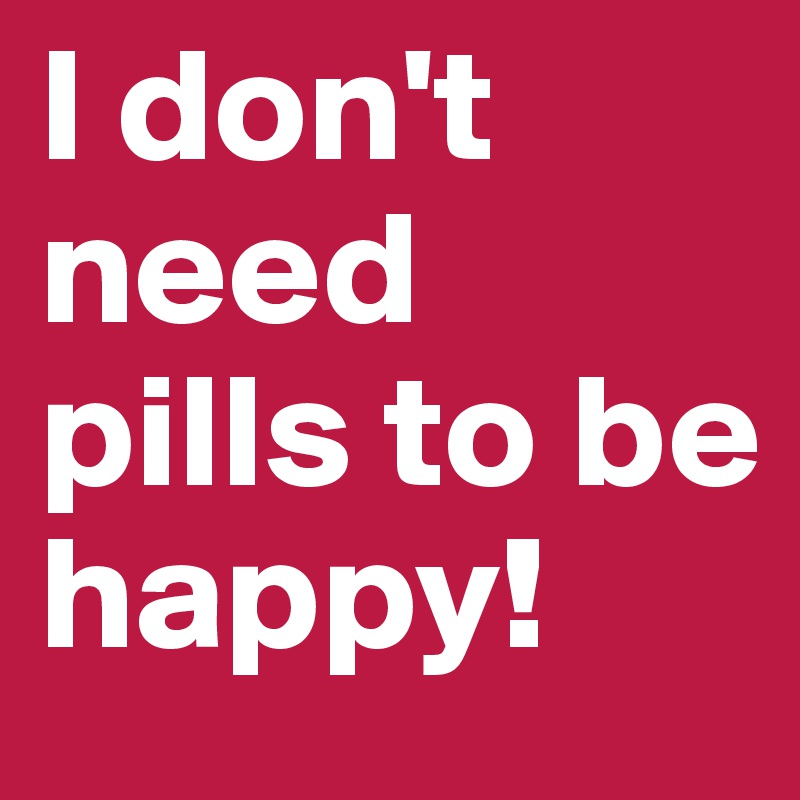
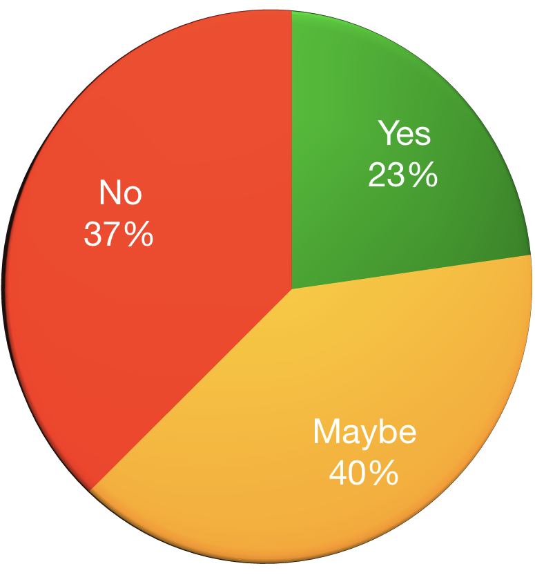
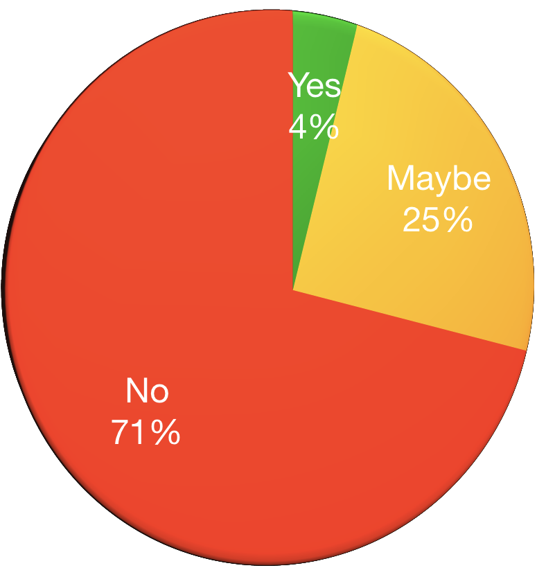

<!-- .slide: class="small-p" -->
## Dealing with mental illness
### Or: How I learned to dislike myself less

J.D. Flynn, Technical Architect

@JDDoesDev • Slack(s): Dorf

@TCDrupal • @OSMIHelp

Note:
- Welcome everyone!
- Thank you for having me

<!--s-->

# Hello!

Note:
I always like to start off with a big friendly greeting, so Hello!

<!--s-->

## Disclaimers:
* ### NOT a doctor<!-- .element: class="fragment" -->
* ### NOT a lawyer<!-- .element: class="fragment" -->
* ### Possible naughty language<!-- .element: class="fragment" -->
* ### It's about to get personal<!-- .element: class="fragment" -->

Note:
I also like to start off by covering my ass

Disclaimer:
- I'm not a mental health professional
- I'm not a legal professional
- I also tend to swear without thinking about it... sorry
- Also, I'm going to go into quite a bit of detail

<!--s-->

# Why are we here?
## Today, that is<!-- .element: class="fragment" -->

Note:
- Hopefully we aren't going to spark a philosophical debate that results in an existential crisis for someone.
- I'm here to talk WITH you about something very important to me, and hopefully to you
- I hope you're here because you want to take part in a conversation, or at least learn something
- Also here to tell story
    - Hope it helps someone the way another person's story helped me

<!--s-->
<!-- .slide: data-background-color="#888f79" -->

# So let's have a conversation!
## You first <!-- .element: class="fragment" -->

Note:
### DO THE FRAGMENT!
- You're going to learn a lot about me
- I like to have an idea of who I'm talking with
- How many of you are developers, designers, or anything directly related to making sites or programming?
- How many of you are project managers, owners, or account managers or similar
- How many of you are in HR?
- How many of you are in upper management? Managers, Presidents, CEOs, etc.

<!--s-->

## Who is this guy?
### OH YEAH, I HAVE MENTAL ILLNESSES<!-- .element: class="fragment" -->

Note:
- Drupal/PHP Developer for 6 years
- Doing HTML since the 90s
- BASIC around the same time
- MidCamp Organizer
- Drupal Chicago Meetup Organizer
- Paramedic/EMT/firefighter for 10 years

<!--s-->

## Why do I care?

 
_**I'm not weak; I'm sick**_ <!-- .element: class="fragment fade-in-then-out" -->

 
_**I'm not damaged; I have a disease**_ <!-- .element: class="fragment fade-in-then-out" -->

 
_**It's not a choice; It's a condition**_ <!-- .element: class="fragment fade-in-then-out" -->

Note:
- I suffered in silence
  - For a very long time I was in denial.  I was afraid that admitting I had an illness would make it real
- Perfect health until doctor tells you otherwise
- I worried that if I told people they'll treat me differently

fragment - Something that I often need to tell myself, and still have a hard time convincing myself of

<!--s-->

# WHAT IS MENTAL ILLNESS?

Note:
- Going to talk a lot about mental illness, otherwise this would be a very short presentation
- Mental illness refers to a wide range of mental health conditions — disorders that affect your mood, thinking and behavior.
- DSM (Diagnostic and Statistical Manual of Mental Disorders) 5 -- latest version published in 2013
    - First one in 1952

<!--s-->

# WHAT IS THIS STIGMA YOU SPEAK OF?

Note:
- For centuries people with mental illnesses were treated as "less than"
- Stereotypes that people with mental illness are dangerous
- People weren't seen as people.  They were their disease
    - a schizophrenic compared to a person with schizophrenia
    - they're bipolar, not someone with bipolar
    - the mentally ill compared to someone with mental illness
- Led to people using mental illness as an insult
- Self-stigma - feeling that your disease defines you and that you're a burden
- Courtesy stigma - family members and loved ones feel shame and guilt for "contributing" to the illness

<!--s-->
<!-- .slide: data-background-color="#008e7f" -->

## Just what mental illnesses are you dealing with, you ask?
- Major Depression <!-- .element: class="fragment" -->
- Anxiety Disorder <!-- .element: class="fragment" -->
- PTSD <!-- .element: class="fragment" -->
- ADHD <!-- .element: class="fragment" -->
- TBD? <!-- .element: class="fragment" -->

Note:
- Well, person I imagined just for this slide... I have:
- I'm one diagnosis away from Mental Illness Bingo
- I say TBD because there is such a high level of comorbidity, or co-existing conditions that I'm bound to collect another square soon
- Let's define these for clarity
<!--s-->
<!-- .slide: data-background-color="#008e7f" -->

# Major Depression

Note:
- Clinical Depression: feelings of low self-worth or guilt and a reduced ability to enjoy life.
    - symptoms that are present _every day_ for at _least 2 weeks_ - WebMD
<!--s-->
<!-- .slide: data-background-color="#008e7f" -->

# Anxiety Disorder

Note:
- Anxiety: characterized by feelings of worry or fear that are strong enough to interfere with daily activities - Mayo Clinic
    - Amygdala - lizard brain - fight || flight, feed || breed
<!--s-->
<!-- .slide: data-background-color="#008e7f" -->

# Post Traumatic Stress Disorder

Note:
- PTSD: failure to recover after experiencing or witnessing a terrifying event - Mayo Clinic
    - Give the "RAM v HDD" metaphor
<!--s-->
<!-- .slide: data-background-color="#008e7f" -->

# Attention Deficit Hyperactivity Disorder

Note:
- ADHD: varying degrees of hyperactivity, impulsivity, and/or inattention that lead to difficulty in academic, emotional, and social functioning.
    - When I was a kid, this was often looked at as being a bit odd or just needing to burn off some energy
<!--s-->
<!-- .slide: data-background-color="#008e7f" -->

## I've only been getting treatment for a short time
(Relatively Speaking)

Note:
- Why do I mention this?  Well, remember when I said it's about to get personal?

<!--s-->
<!-- .slide: data-background-color="#675b53" -->

## My normal was not normal

Note:
- For as long as I can remember, I felt this way
- Nature v Nurture debate
    - My childhood was rough
    - Witnessed physical and verbal abuse
    - I was emotionally abused
        - This can take many forms, and I went through most of them
    - I was left alone a lot
    - I had a hard time making connections
    - Few friends
    - Overweight, ugly, bad hygiene
    - Bullied... a lot
    - Didn't know how to handle emotions so I cried a lot or lashed out a lot.
- I thought it was all my fault.  I was defective.  I was unlikable.  I scared people away.
- I never had a sense of safety at home so I became afraid of everything
- I had one enemy in particular.  Ready to meet them?

<!--s-->
<!-- .slide: data-background-color="#008e7f" -->

### Introducing: My nemesis

  
  
You're worthless

  
You're ugly

  
Nobody likes you

  
I hate you

<!--s-->
<!-- .slide: data-background-color="#675b53" data-autoslide="1500"-->

## Every. Single. Day.

  
  
You're worthless

  
You're ugly

  
Nobody likes you

  
I hate you

  
You're WORTHLESS

  
You're UGLY

  
NOBODY likes you

  
I HATE you

  
YOU'RE WORTHLESS

  
YOU'RE UGLY

  
NOBODY LIKES YOU

  
I HATE YOU

  

Note:
- I hated what I saw
- I couldn't understand how anyone could like me
- But it wasn't the mirror saying it, it was my reflection so it was me

<!--s-->
<!-- .slide: data-background-color="#675b53" -->

## This was the norm for most of my life

Note:
- Sometimes I would try to fake confidence
    - It didn't work
- Sometimes I would act like things didn't bother me
    - They did
- Sometimes I would get angry
    - Okay, I was angry all the time
- Paranoid about everything
- Afraid of everything
- Deep, deep valleys
- Felt useless
- Unable to function
- I mess up everything I touch
- Unable to focus
- constantly in fear of losing my job because of reduced output due to depression
- spent a lot of time trying to figure out what was wrong with me

<!--s-->

## I wasn't allowed to have mental illness

Note:
- I was a paramedic in public service
    - We don't get sick, we help the sick
    - We're above having mental illness
    - I can name way too many people I worked with who died of suicide

<!--s-->

## Then something happened

Note:
Well, let me correct that...
<!--s-->

## Then some things happened

Note:
- I wish I could say it was a single moment, but it wasn't
- It was a series of events
    - College car story
    - Full blown panic attack, not the first, but one that I finally questioned

<!--s-->

## Career Change

Note:
- I got into development and I started hanging out in online developer communities
- Developer community is more inclusive and understanding than my previous life

<!--s-->

## Health Scare

Note:
- I found a lump where there shouldn't be a lump and I got scared
- Started re-evaluating a lot of things

<!--s-->

## I accepted I needed help

Note:
- The first thing was the hardest. I saw other people living happy lives and not going through the same things I was.
- People didn't get as angry as I did as easily as I did.
- People weren't affected by everyday things like I was and I had an epiphany that maybe everything else wasn't the issue. Maybe it was me?
    - if everywhere you go smells like dog crap, maybe you should look at your own shoes
- For a lot of people (including myself) this is the hardest part
- All the signs were there, but I couldn't see them

<!--s-->
<!-- .slide: data-background-color="#675b53" -->

## Fear...

Note:
- Constantly afraid
- crippling fear of everyday things
- Social situations were paralyzing
- canceled plans a lot
- Paranoid about everything

<!--s-->
<!-- .slide: data-background-color="#675b53" -->

## Led to Anger...

Note:
- I was not a happy person and anything could set me off
- Think of that lizard brain
    - Fight or flight, feed or breed
    - If I can't eat it or make babies with it, I'm going to run away or fight

<!--s-->
<!-- .slide: data-background-color="#675b53" -->

## Led to Hate...

Note:
- This was usually a misunderstanding.
    - Okay, I did get angry and hateful sometimes
    - I once threw a couch in rage... not proudest moment, looking back

<!--s-->
<!-- .slide: data-background-color="#675b53" -->

## Led to suffering

Note:
- I finally realized that I had been suffering and that there was something I could do about it

<!--s-->
<!-- .slide: data-background="./img/yoda.jpg" data-background-size="contain" style="margin-top: -10rem;" -->
## Sound familiar?

Note: A wise muppet once said...
<!--s-->
<!-- .slide: data-background-color="#675b53" -->

# Finally, I GOT TREATMENT!

Note:
- I take medication
    - Better living through chemistry
- I see a therapist
- I find outlets
    - active in the community through teaching and in the drupal community
- I start the conversation

<!--s-->
<!-- .slide: data-background-color="#675b53" -->

# But It wasn't easy

Note:
- There was a frustrating period between collecting my first diagnoses and getting medicated
- During this time I attended a talk by Ed Finkler
- This helped me realize something very important

<!--s-->

# WE'RE NOT ALONE

Note:
- Since getting diagnosed and erasing stigma from myself I've realized I'm not alone
    - Which means we're not alone
- Nobody is the only one going through this
    - May have different variables, but the interface is the same
- I realized that I was afraid because of the way people viewed me
- I don't feel that way anymore because of organizations like OSMI

<!--s-->

# How has treatment affected me?

Note:
- I'm not ashamed of who I am
    - Before, I wanted to hide in shame because of who I am and my conditions.  I've since realized that it's just part of me.  not too proud to admit i need help anymore
- The valleys aren't as deep
  - Not to say they aren't around anymore or that I don't have deep valleys, but they are much less frequent than before and more manageable.
- My anxiety has gone down, but still rears its ugly head occasionally
- Since getting on medication and seeing a therapist,
    - I've become more comfortable in social situations,
    - still introverted, so after this i'm going to need to hide for a little while
    - I don't have nearly as many anxiety attacks or times when I am unreasonably afraid of doing normal things

<!--s-->
<!-- .slide: data-background="./img/osmi_logo.png" data-background-size="contain" -->

# Now I work with OSMI

Note:
- Open Sourcing Mental Illness
- Focused on erasing the stigma around mental illness, specifically in the tech community
- Founded by Ed Finkler
- Run by some amazing people

<!--s-->

### Also, I can tolerate this thing a little more

  
  
You're tolerable

  
I've seen worse

  
Someone might want you around

  
Even though we don't agree on everything, you have some valid opinions and shouldn't be afraid to share them occasionally

<!--s-->

# We're not alone!

Note:
- I mean this in general, but more specifically in the tech community

<!--s-->

# WHY TECH SPECIFICALLY?

Note:
- Suspected for a long time
- Creatives appeared to be more prone to depression and anxiety
- Sites like now OSMI forums and word of mouth were all there were to go on
- Intelligent and creative people tend to think over situations more than others.
- Many people can "let go" of events or not look for cause/event connection
- Creative thinkers tend to re-play events over and over again to better understand them.
- Replaying can lead to feeling depressed or hopeless

<!--s-->

# IMPOSTER SYNDROME

Note:
- The feeling that you don't deserve to be doing what you're doing
- Give example of how you deal with it/are dealing with it.
    - Asking for help isn't weakness
    - Showing that you have limits
- Mention that it's common with people on FED discord
- inability to take compliments

<!--s-->

## More unexpected audience participation!
Note:
- I've been going on for a while now
- Let's change it up a bit and ask some more questions

<!--s-->
<!-- .slide: data-background-color="#675b53" -->

## Would you tell someone with glasses or contacts to try looking harder?

<!--s-->
<!-- .slide: data-background-color="#675b53" -->

## Would you ask someone in a wheelchair why they decided not to walk?

<!--s-->
<!-- .slide: data-background-color="#675b53" -->

## Would you tell someone with diabetes or a heart condition to stop taking their medicine and to snap out of it?

Note:
Pretty silly, right?  Let's switch it up.
<!--s-->
<!-- .slide: data-background-color="#675b53" -->

### Would you tell someone with ~~glasses or contacts~~ depression to try ~~looking harder~~ being happy?

<!--s-->
<!-- .slide: data-background-color="#675b53" -->

### Would you ask someone in a ~~wheelchair~~ panic attack if they've considered trying harder to ~~walk~~ not have anxiety?

<!--s-->
<!-- .slide: data-background-color="#675b53" -->

### Would you tell someone with ~~diabetes or a heart condition~~ ADHD to stop taking their medicine and to just try ~~being healthy~~ focusing?

<!--s-->
<!-- .slide: data-background-color="#675b53" -->

### Images like this

<!--s-->
<!-- .slide: data-background-color="#675b53" -->

### This...

<!--s-->
<!-- .slide: data-background-color="#675b53" -->

### And this...

<!--s-->
<!-- .slide: data-background-color="#675b53" -->

## They all pretty much say the same thing

Note:
They all say the same thing
- It's a decision to feel this way
- You don't need help
- It something you can will yourself out of
- Personally, I can vouch for the effects of medication
  - Everyone is different and what works for me may not work for the next person
  - Sure, there are a few side effects, but the benefits greatly outweigh the side effects

<!--s-->

### But remember...

<!--s-->

## So how do we Erase the Stigma?

<!--s-->

## We need to be...

<!--s-->

# __STRONGER THAN FEAR__
<!-- .slide: data-background="./img/osmi_logo.png" data-background-size="contain" -->

Note:
- What does that mean?
    - Not "beat your fear at arm wrestling"
- Start the conversation
- Listen
- Let people know they matter
- Don't be ashamed
- If you have a mental illness, you're not damaged; you have a disease
- Be respectful
    - Not all disabilities are visible
    - Not all cuts bleed
    - Try to be respectful of what you say or how you portray diseases.
    - Sad != depressed, organized != OCD
        - OCD blueberry talk - Marissa Lyman
- If you do feel that you have a disease, get treatment!

<!--s-->

## Let's look at some stats

Note:
- Anecdotes are one thing, but facts help show i'm not full of shit
- We've done science!

<!--s-->
<!-- .slide: data-background="./img/osmi_logo.png" data-background-size="contain" -->

## Mental Health in Tech 2017 Survey Results
#### With a little help from 2016

[osmihelp.org/research](osmihelp.org/research)

Note: This survey was done by OSMI and had approximately 800 responses.  The survey was made available to several different communities.  All responses are self-reported.

<!--s-->

<!-- .slide: class="chartSlide" -->
Would you bring up a _PHYSICAL_ health issue with a potential employer at an interview?

 <!-- .element: class="fragment chart" data-fragment-index="1" -->

Note: Almost twice as many say "NO"
<!--s-->

<!-- .slide: class="chartSlide" -->
Would you bring up a _MENTAL_ health issue with a potential employer at an interview?

 <!-- .element: class="fragment chart" data-fragment-index="1" -->

Note: Almost twice as many say "NO"
<!--s-->

<!-- .slide: class="chartSlide" -->
Do you feel that being identified as a person with a mental health issue would hurt your career? (2016)

 <!-- .element: class="fragment chart" data-fragment-index="1" -->

Note:  Only 12% say "no".  That speaks volumes to me.
- This is something I worry about every time I give this talk, but it is kind of freeing knowing that all my cards are on the table

<!--s-->

<!-- .slide: class="chartSlide" id="surveySlides" -->
Do you think discussing a PHYSICAL health issue with your employer would have negative consequences? (2016)

 <!-- .element: class="fragment chart" data-fragment-index="1" -->

<!--s-->
<!-- .slide: class="chartSlide" -->
Do you think discussing a MENTAL health issue with your employer would have negative consequences? (2016)

 <!-- .element: class="fragment chart" data-fragment-index="1" -->

Note: Over 5x more think that there would _definitely_ be negative consequences

<!--s-->

<!-- .slide: class="chartSlide" -->
Have you been diagnosed with a mental health condition?

 <!-- .element: class="fragment chart" -->

Note:
- This is self reported
- Average is around 20%
- 800 responses
<!--s-->

<!-- .slide: class="chartSlide" -->
Do you _Think_ you have a mental health condition?

 <!-- .element: class="fragment chart" -->

Note:
- This is self reported
- Average is around 20%
- 800 responses
- includes people who answered yes to diagnosed

<!--s-->
<!-- .slide: data-background-color="#888f79" -->

## What do these mean?

<!--s-->
<!-- .slide: data-background-color="#360101" -->

 ## We're afraid to talk about mental illness
 ## We're not alone <!-- .element: class="fragment chart" -->

 Note:
 Especially if we're the ones suffering from it
 FRAGMENT: It also means
<!--s-->
<!-- .slide: data-background-color="#360101" -->

## Why are we afraid?  It's because of the stigma.

<!--s-->

## We're afraid that being honest will have negative consequences

Note:
- We're afraid people will change their opinion of us
- Especially as someone with anxiety, worrying really can be scary
- Some of our minds go straight to the worst case scenario
- Mention email of "we need to talk" on 89th day of 90 day probation and "password incorrect" email error
- Binary mind

<!--s-->

## We're afraid we might get sent to the ~~principal's&nbsp;office~~ HR Department

Note:
- How many of you talk with HR on a regular basis
    - This could be a good or bad thing
<!--s-->

## As of 2015 _17.9%_ of _All_ U.S. Adults had some form of Mental Illness

Note:
"In 2015, there were an estimated 43.4 million adults aged 18 or older in the United States with any mental illness within the past year. This number represented 17.9% of all U.S. adults." - National Institute of Mental Health

- AMI - Any mental illness

<!--s-->

## Why should a workplace care?

Note:
- depression alone impacts an estimated 9.5 percent of the American adult population.
- estimated to cause 200 million lost work days each year
  -  costing employers up to $44 billion annually

<!--s-->

## But JD, What can we do?

Note:
Great question, slide!
Well, how do you eat an elephant?  One bite at a time.
- If a workplace creates a culture of inclusiveness, an employee may feel more comfortable being open
    - Do very little for days
    - Get angry that I couldn't function
    - Get afraid because I wasn't succeeding
- May have felt more comfortable saying "I need a day off"

<!--s-->

## Take the OSMI 2019 Survey

## https://osmihelp.org/research

<!--s-->
## Get the OSMI handbooks

## http://bit.ly/osmi-books
<!-- .element: class="normie" -->

Note:  Not trying to sell anything, but the books are DRM free and extremely useful
 - Mental Health in Tech: Guidelines for Mental Wellness in the Workplace
 - Mental Health in Tech: Guidelines for Executives and HR Professionals
 - Mental Health in Tech: Guidelines for Employees
<!--s-->

## Seriously, Take the OSMI 2019 Survey

## https://osmihelp.org/research

<!--s-->
<!-- .slide: data-background-color="#008e7f" -->

## In open source tech, community is our greatest resource

Note:
Time to bring it home --
Especially in open source communities

<!--s-->
<!-- .slide: data-background-color="#008e7f" -->

## *__43%__* of survey respondents claimed mental illness diagnoses

Note: So what does that mean?

<!--s-->
<!-- .slide: data-background-color="#008e7f" -->

# We are not alone

<!--s-->
<!-- .slide: data-background-color="#008e7f" -->

# We are more than usernames

Note:
Something that events like this help remind us of

<!--s-->
<!-- .slide: data-background-color="#008e7f" -->

# We are real people

Note:
Look around.  We're not 1s and 0s.  We're actually here interacting

<!--s-->
<!-- .slide: data-background-color="#008e7f" -->

# We are not damaged

Note: And with a little work, together we can....

<!--s-->

# Erase the stigma
<!-- .slide: data-background="./img/osmi_logo.png" data-background-size="contain" -->

<!--s-->

#### Some resources available:
- osmihelp.org
- Psychologytoday.com
- Suicide Lifeline: 1-800-273-8255
- 911 (or your equivalent)
- mentalhealthfirstaid.org

<!--s-->

## Thank you for letting me talk with you

<!--s-->

### Survey at
### http://bit.ly/jdf-survey
<!-- .element: class="normie" -->

### Donate to OSMI
### http://osmihelp.org/donate
<!-- .element: class="normie" -->

<!--s-->

# Questions?
