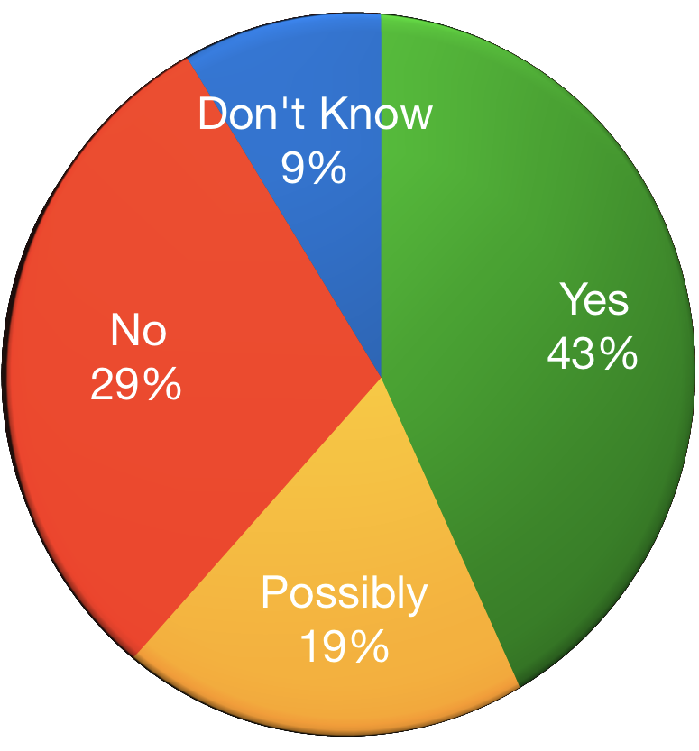

### ERASING THE STIGMA
## MENTAL ILLNESS IN TECH

J.D. Flynn, Drupal Technical Architect at Genuine

@JDDoesDev • Slack(s): Dorf • D.O: Dorficus

DrupalCon • #DrupalCon • #OSMI

Note:
- Welcome everyone!

<!--s-->

# Hello!

Note:
- I find it best to start off with a big friendly greeting.
- Thanks
- Not me talking to you
- Conversation: me + you about us

<!--s-->

## who the heck is this guy?
### OH YEAH, I HAVE MENTAL ILLNESSES<!-- .element: class="fragment" -->

Note:
You may be asking yourself, who is this random person?
- Drupal/PHP Developer for 6 years
- Doing HTML since the 90s
- MidCamp Organizer
- Drupal Chicago Meetup Organizer
- Paramedic/EMT/firefighter for 10 years

__FRAGMENT__
- I also have mental illnesses

<!--s-->

### Disclaimers:
## NOT a doctor<!-- .element: class="fragment" -->
## Possible naughty language<!-- .element: class="fragment" -->

Note:
- Disclaimer:  I'm not a mental health professional nor am I here to give medical advice
- I am someone with mental illnesses - plural
- I also tend to swear without thinking about it... sorry

<!--s-->
<!-- .slide: data-background-color="#888f79" -->

## WHY TALK ABOUT THIS?

Note:
There are a few reasons I do this talk.
- "Start the conversation"
    - How many of you are comfortable talking about mental illness?
    - What do most people think of the mentally ill? They’re dangerous. They're unstable. They're weak.
- Share some resources and statistics
- Share some experiences, both personal and professional
- I've seen firsthand what untreated mental illness can do

Also, to help people realize...

<!--s-->
<!-- .slide: data-background-color="#888f79" -->

# WE'RE NOT ALONE

Note:
- Nobody is the only one going through this
    - May have different variables, but the interface is the same
- I'm still having a hard time dealing with this fact

<!--s-->
<!-- .slide: data-background-color="#888f79" -->

# **IT NEEDS TO BE TALKED ABOUT**

Note:
- I want you to be comfortable having a conversation
- Take away the fear and stigma by talking
- And you people are here.  You're taking the right steps.  Even if you don't have mental illness yourself, thank you!

<!--s-->

## WHY SHOULD THIS BE IMPORTANT TO YOU?

Note:
- Because we're human
- 20% of US adults experience MI in a year
- We'll find out later it's much higher in the tech community

<!--s-->

## WHY IS THIS IMPORTANT TO ME?
### _**I'm not weak; I'm sick**_ <!-- .element: class="fragment" -->

Note:
- As I mentioned, I have mental illness
- I suffered in silence
    - For a very long time I was in denial.
    - Guilty of the stigma.
    - i thought mental illness meant someone was damaged or defective and i didn't want to be either
- I worried that if I told people how i felt, they'd leave me

fragment - Something that I often need to tell myself.  Not defective or damaged, I have a disease.  It's a disorder, not a decision.

<!--s-->
<!-- .slide: data-background-color="#675b53" -->
## ABOUT YOU

### AKA Unexpected audience participation

Note:
You're going to learn a lot about me, so I'd like to learn a little about you
- How many of you are developers or here to learn development, themers, site builders, designers, or anything directly related to making sites?
- How many of you are project managers, owners, or account managers or similar
- How many of you are in HR?
  - I'm going to give HR a hard time, but I do understand they have a hard job
- How many of you are in upper management? Managers, Presidents, CEOs, etc.

<!--s-->

# WHAT IS MENTAL ILLNESS?

Note:
- Mental illness refers to a wide range of mental health conditions — disorders that affect your mood, thinking and behavior. - Mayo Clinic
- DSM 5 -- latest version

<!--s-->
<!-- .slide: data-background-color="#360101" -->

### TIME TO GET UNCOMFORTABLY PERSONAL
- Major Depression <!-- .element: class="fragment" -->
- Anxiety Disorder <!-- .element: class="fragment" -->
- PTSD <!-- .element: class="fragment" -->
- ADHD <!-- .element: class="fragment" -->

Note:
- Clinical Depression: feelings of low self-worth or guilt and a reduced ability to enjoy life.
    - symptoms that are present _every day_ for at _least 2 weeks_ - WebMD
- Anxiety: characterized by feelings of worry or fear that are strong enough to interfere with daily activities - Mayo Clinic
    - Amygdala - lizard brain - fight || flight, feed || breed
- PTSD: failure to recover after experiencing or witnessing a terrifying event - Mayo Clinic
    - Give the "RAM v HDD" metaphor
- ADHD: varying degrees of hyperactivity, impulsivity, and/or inattention that lead to difficulty in academic, emotional, and social functioning.
    - When I was a kid, this was often looked at as being a bit odd or just needing to burn off some energy

<!--s-->
<!-- .slide: data-background-color="#675b53" -->

## WHAT WAS LIFE LIKE BEFORE I SOUGHT TREATMENT?
### Difficult <!-- .element: class="fragment" -->

Note:
- Let me summarize: difficult.

<!--s-->
<!-- .slide: data-background-color="#675b53" -->

## WHAT WAS LIFE LIKE BEFORE I SOUGHT TREATMENT?
### Afraid

Note:  Also mention:
- Paranoid about everything
- crippling fear of everyday things
- Social situations were paralyzing

<!--s-->
<!-- .slide: data-background-color="#675b53" -->
## WHAT WAS LIFE LIKE BEFORE I SOUGHT TREATMENT?
### Angry
<!-- .element: class="fragment" -->

Note:
- I was not a happy person and anything could set me off
    - That lizard brain!
    - What does a lizard do when it's scared?
- Mix of high stress job (ambulance) and untreated anxiety and depression were not a good combination
    - Like many people in public service, I was too proud to admit something was wrong
    - Unlike too many people in PS, I sought treatment

<!--s-->
<!-- .slide: data-background-color="#675b53" -->

## WHAT WAS LIFE LIKE BEFORE I SOUGHT TREATMENT?
### Alone

Note:
- i was alone because i canceled plans and made myself alone
- Feel alone in crowded spaces
    - self imposed isolation
- Always feel like people are looking at me for any flaws

<!--s-->
<!-- .slide: data-background-color="#675b53" -->

## WHAT WAS LIFE LIKE BEFORE I SOUGHT TREATMENT?
### Misunderstood

Note:
- People often thought I was angry when I was terrified or just trying not to screw up
- Easier to lash out than let people know there's something wrong

<!--s-->
<!-- .slide: data-background-color="#675b53" -->
## I accepted something was wrong

Note:
- The first thing was the hardest. I saw other people living happy lives and not going through the same things I was.
- People didn't get as upset or angry about things the way that I did
- People weren't affected by everyday things like I was and I had an epiphany that maybe everything else wasn't the issue. Maybe it was me?
  - if everywhere you go smells like dog crap, maybe you should look at your own shoes
- For a lot of people (including myself) this is the hardest part
- So then...

<!--s-->
<!-- .slide: data-background-color="#675b53" -->

# I GOT TREATMENT

Note:
- Treatment is different for everyone.
- Medication and therapy work for me
- What works for me may not work for you
- YMMV
Also:
- Not shy about it
- Don't need to go into details, but not afraid to mention it

<!--s-->

## How has treatment affected me?

Note:
- I'm not ashamed of who I am
    - just part of me.
    - not too proud to admit
- The valleys easier to cope with
    - Still have valleys, sometimes for days or weeks
    - Much more tolerable than they were before
- My anxiety has gone down
    - Still have the occasional attack
- More comfortable with myself
- Take losses a little better
- I am not as afraid of losing my job because of being unable to focus
- Also, i realize...

<!--s-->
<!-- .slide: data-background-color="#008e7f" -->

# WE'RE NOT ALONE

Note:
Said it before, say it again
- Since getting diagnosed and getting past the stigma, realized not alone
- I realized that I was afraid because of the way people viewed me
- I don't feel that way anymore because of organizations like OSMI

<!--s-->

## WHY TECH SPECIFICALLY?

Note:
- Suspected for a long time
- Creatives appeared to be more prone to depression and anxiety
- Sites like devpressed.com (now OSMI forums) and word of mouth were all there were to go on

- Intelligent and creative people tend to think over situations more than others.
- Many people can "let go" of events or not look for cause/event connection
- Creative thinkers tend to re-play events over and over again to better understand them.
- Replaying can lead to feeling depressed or hopeless

<!--s-->

## IMPOSTER SYNDROME

Note:
- The feeling that you don't deserve to be doing what you're doing
- Give example of how you deal with it/are dealing with it.  Mention that it's common with people on FED slack.
- inability to take compliments

<!--s-->

## More unexpected audience participation!
Note:  Let's change it up a bit and ask some more questions

<!--s-->
<!-- .slide: data-background-color="#675b53" -->

## Would you tell someone with glasses or contacts to try looking harder?

<!--s-->
<!-- .slide: data-background-color="#675b53" -->

## Would you ask someone in a wheelchair why they decided not to walk?

<!--s-->
<!-- .slide: data-background-color="#675b53" -->

## Would you tell someone with diabetes or a heart condition to stop taking their medicine and to snap out of it?

Note:
Pretty silly, right?  Let's switch it up.
<!--s-->
<!-- .slide: data-background-color="#675b53" -->

### Would you tell someone with ~~glasses or contacts~~ depression to try ~~looking harder~~ being happy?

<!--s-->
<!-- .slide: data-background-color="#675b53" -->

### Would you ask someone in a ~~wheelchair~~ panic attack if they've considered trying harder to ~~walk~~ not have anxiety?

<!--s-->
<!-- .slide: data-background-color="#675b53" -->

### Would you tell someone with ~~diabetes or a heart condition~~ ADHD to stop taking their medicine and to just try ~~being healthy~~ focusing?

<!--s-->
<!-- .slide: data-background-color="#675b53" -->

### Images like this

<!--s-->
<!-- .slide: data-background-color="#675b53" -->

### This...

<!--s-->
<!-- .slide: data-background-color="#675b53" -->

### And this...

Note:
They all say the same thing
- It's a decision to feel this way
- You don't need help
- It something you can will yourself out of
- Personally, I can vouch for the effects of medication
  - Everyone is different and what works for me may not work for the next person

<!--s-->

### Memes go both ways

<!--s-->

## So how do we Erase the Stigma?

Note:
We need to be.

<!--s-->

# __STRONGER THAN FEAR__
<!-- .slide: data-background="./img/osmi_logo.png" data-background-size="contain" -->

Note:

- What does that mean?
    - Not "beat your fear at arm wrestling"
- Start the conversation
- Listen
- Let people know they matter
- Don't be ashamed
- If you have a mental illness, you're not damaged; you have a disease
- Be respectful
    - Not all disabilities are visible
    - Try to be respectful of what you say or how you portray diseases.
    - Sad != depressed, organized != OCD
- If you do feel that you have a disease, get treatment!
<!--s-->

## Let's look at some stats

Note:
- Anecdotes are one thing
- We've done science!

<!--s-->
<!-- .slide: data-background="./img/osmi_logo.png" data-background-size="contain" -->

## Mental Health in Tech 2017 Survey Results

[osmihelp.org/research](osmihelp.org/research)

Note: This survey was done by OSMI and had approximately 800 responses.  The survey was made available to several different communities.  All responses are self-reported.

<!--s-->

<!-- .slide: class="chartSlide" -->
Would you bring up a _PHYSICAL_ health issue with a potential employer at an interview?

 <!-- .element: class="fragment chart" data-fragment-index="1" -->

Note: Almost twice as many say "NO"
<!--s-->

<!-- .slide: class="chartSlide" -->
Would you bring up a _MENTAL_ health issue with a potential employer at an interview?

 <!-- .element: class="fragment chart" data-fragment-index="1" -->

Note: Almost twice as many say "NO"
<!--s-->

<!-- .slide: class="chartSlide" -->
Do you feel that being identified as a person with a mental health issue would hurt your career? (2016)

 <!-- .element: class="fragment chart" data-fragment-index="1" -->

Note:  Only 12% say "no".  That speaks volumes to me.
- This is something I worry about every time I give this talk, but it is kind of freeing knowing that all my cards are on the table

<!--s-->

<!-- .slide: class="chartSlide" id="surveySlides" -->
Do you think discussing a health issue with your employer would have negative consequences? (2016)

 <!-- .element: class="fragment chart" data-fragment-index="1" -->

Note: Over 5x more think that there would _definitely_ be negative consequences

<!--s-->

<!-- .slide: class="chartSlide" -->
Have you been diagnosed with a mental health condition?

 <!-- .element: class="fragment chart" -->

Note:
- This is self reported
- Average is around 20%
- 800 responses
<!--s-->

<!-- .slide: class="chartSlide" -->
Do you _Think_ you have a mental health condition?

 <!-- .element: class="fragment chart" -->

Note:
- This is self reported
- Average is around 20%
- 800 responses
- includes people who answered yes to diagnosed

<!--s-->
<!-- .slide: data-background-color="#888f79" -->

## What do these mean?

<!--s-->
<!-- .slide: data-background-color="#360101" -->

 ## We're afraid to talk about mental illness
 ## We're not alone <!-- .element: class="fragment chart" -->

 Note:
 Especially if we're the ones suffering from it
 FRAGMENT: It also means

<!--s-->
<!-- .slide: data-background-color="#360101" -->

## Why are we afraid?  It's because of the stigma.

<!--s-->

## We're afraid that being honest will have negative consequences

For many of us, this means suffering in silence

Note:
- We're afraid people will change their opinion of us
- Especially as someone with anxiety, worrying really can be scary
- Some of our minds go straight to the worst case scenario
- Mention email of "we need to talk" on 89th day of 90 day probation and "password incorrect" email error
- Binary mind

<!--s-->

## We're afraid we might get sent to the ~~principal's&nbsp;office~~ HR Department

Note:
- How many of you talk with HR on a regular basis
    - This could be a good or bad thing

<!--s-->

## In of 2015 _17.9%_ of _All_ U.S. Adults had some form of Mental Illness

Note:
"In 2015, there were an estimated 43.4 million adults aged 18 or older in the United States with any mental illness within the past year. This number represented 17.9% of all U.S. adults." - National Institute of Mental Health

- AMI - Any mental illness

<!--s-->

## Why should a workplace care?

Note:
- depression alone impacts an estimated 9.5 percent of the American adult population.
- estimated to cause 200 million lost work days each year
  -  costing employers up to $44 billion annually

<!--s-->

## But JD, What can we do?

Note:
Great question, slide!
Well, how do you eat an elephant?  One bite at a time.
- If a workplace creates a culture of inclusiveness, an employee may feel more comfortable being open
    - Do very little for days
    - Get angry that I couldn't function
    - Get afraid because I wasn't succeeding
- May have felt more comfortable saying "I need a day off"
<!--s-->

## Take the OSMI 2019 Survey

## https://osmihelp.org/research

<!--s-->

## Fight ignorance with information

Note: mention the exit interview and sending a link to OSMI
- Mental Health First Aid class - great for HR, managers, or anyone

<!--s-->

## Take the OSMI 2019 Survey

## https://osmihelp.org/research

<!--s-->
## Get the OSMI handbooks

## http://bit.ly/osmi-books

Note:  Not trying to sell anything, but the books are DRM free and extremely useful
 - Mental Health in Tech: Guidelines for Mental Wellness in the Workplace
 - Mental Health in Tech: Guidelines for Executives and HR Professionals
 - Mental Health in Tech: Guidelines for Employees
<!--s-->

## Seriously, Take the OSMI 2019 Survey

## https://osmihelp.org/research

<!--s-->
<!-- .slide: data-background-color="#008e7f" -->

## In open source tech, community is our greatest resource

Note:
Time to bring it home --
Especially in open source communities

<!--s-->
<!-- .slide: data-background-color="#008e7f" -->

## *__43%__* of survey respondents claimed mental illness diagnoses

Note: So what does that mean?

<!--s-->
<!-- .slide: data-background-color="#008e7f" -->

# We are not alone

<!--s-->
<!-- .slide: data-background-color="#008e7f" -->

# We are more than usernames

Note:
Something that events like this help remind us of

<!--s-->
<!-- .slide: data-background-color="#008e7f" -->

# We are real people

Note:
Look around.  We're not 1s and 0s.  We're actually here interacting

<!--s-->
<!-- .slide: data-background-color="#008e7f" -->

# We are not damaged

Note: And with a little work, together we can....

<!--s-->

# Erase the stigma
<!-- .slide: data-background="./img/osmi_logo.png" data-background-size="contain" -->

<!--s-->

#### Some resources available:
- osmihelp.org
- Psychologytoday.com
- National Association on Mental Illness: 1-800-950-NAMI
- Suicide Lifeline: 1-800-273-8255
- 911 (or your equivalent)

<!--s-->

## Thank you for letting me talk with you

<!--s-->

### Feedback
- Session Survey Available on session node
- DrupalCon Survey Available at https://www.surveymonkey.com/r/DrupalConSeattle

<!--s-->

# Questions?

<!--s-->
<!-- .slide: data-background="./img/contrib.png" data-background-size="contain" -->
